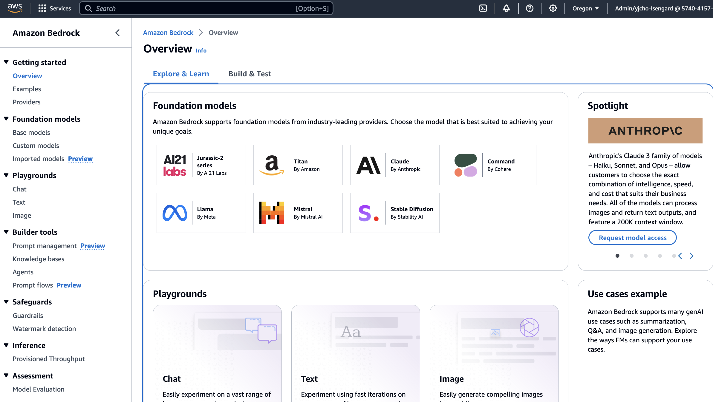
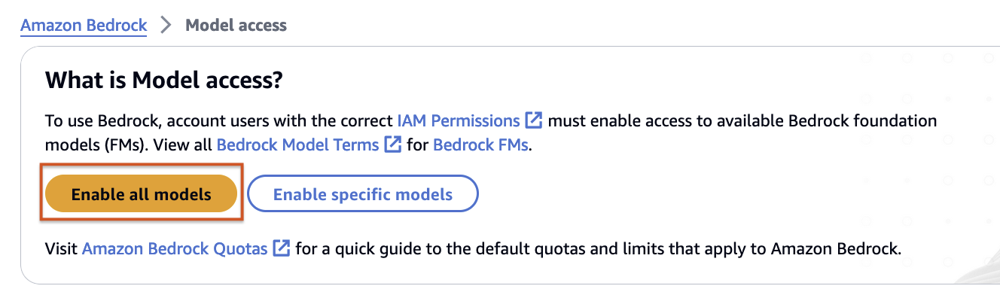
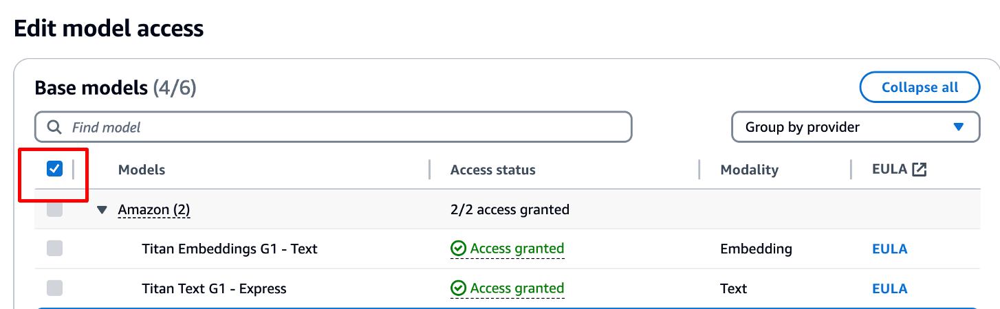
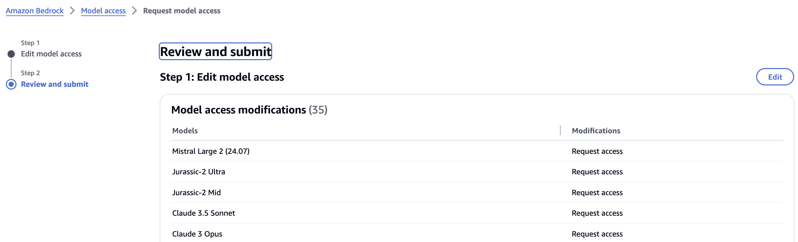
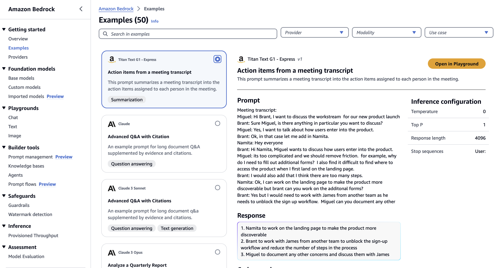
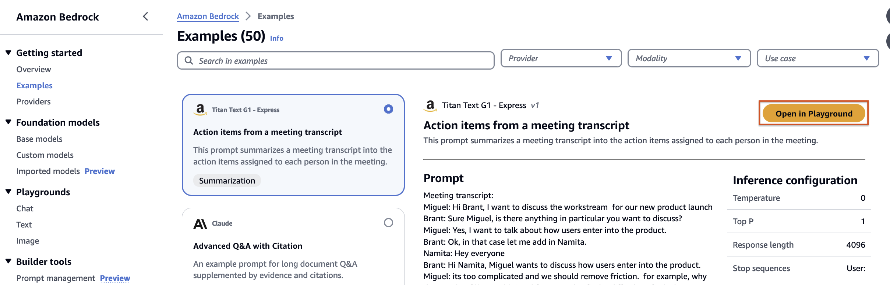
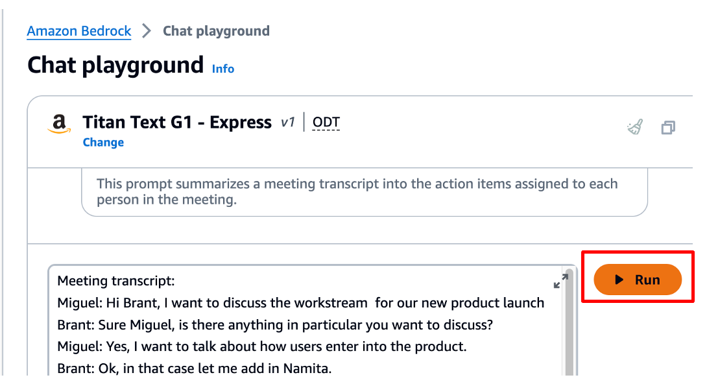

# 실습 1: Bedrock 핸즈온 시작하기

## Bedrock Console 둘러보기
Amazon Bedrock 핸즈온 과정에서 참석해주셔서 감사합니다. 

Amazon Bedrock은 AI21 Labs, Anthropic, Cohere, Meta, Mistral AI, Stability AI, Amazon과 같은 주요 AI 회사의 고성능 FM을 쉽게 이용하여 최신의 생성형 AI 혁신을 빠르게 조정하고 활용할 수 있도록 도와줍니다. 

본격적인 실습에 앞서 Amazon Bedrock 콘솔의 몇 가지 주요 기능에 대해 먼저 살펴보겠습니다.
 

1. Amazon Bedrock에 액세스할 수 있는 계정에 로그인합니다.

2. AWS 콘솔 상단 메뉴에서 **US West (Oregon)** 리전을 선택합니다.

  
3. 다음 Amazon Bedrock 콘솔로 이동해서 **Get Started**를 선택합니다.

4. Amazon Bedrock Console은 다양한 모델, 프롬프트 및 추론 매개변수를 실험해 볼 수 있는 좋은 방법 중 하나입니다. 몇 분만 시간을 내어 콘솔의 다양한 기능을 살펴보세요.

 

* **Getting started(시작하기)** - 탐색 창의 시작하기에서 Amazon Bedrock이 제공하는 파운데이션 모델, 예시 및 플레이그라운드에 대한 개요를 확인할 수 있습니다. Amazon Bedrock 모델에서 사용할 수 있는 프롬프트의 예시도 확인할 수 있습니다.

* **Foundation models(파운데이션 모델)** - 탐색 창의 파운데이션 모델에서 사용 가능한 기본 모델을 보고 다양한 속성별로 모델을 그룹화할 수 있습니다. 모델 보기를 필터링하고, 모델을 검색하고, 모델 제공업체에 대한 정보를 볼 수도 있습니다.

  * AI21 Labs - 엔터프라이즈용으로 구축되어 텍스트 생성, 질문 응답, 요약 등의 다양한 작업에 대한 지침을 따르는 FM
  * Amazon - 텍스트 및 이미지 생성, 요약, 분류, 개방형 Q&A, 정보 추출, 텍스트 또는 이미지 검색에 맞는 FM
  * Anthropic - 헌법적 AI로 훈련된 사려 깊은 대화, 콘텐츠 제작, 복잡한 추론, 창의적인 글쓰기 및 코딩을 위한 FM
  * Cohere - 텍스트를 생성하고, 요약하고, 검색하고, 클러스터링하고, 분류하고, RAG를 사용하는 텍스트 생성 및 표현 모델
  * Meta - 대화 사용 사례와 Q&A, 독해와 같은 자연어 작업에 적합한 모델
  * Mistral AI - 텍스트 요약, 텍스트 분류, 텍스트 완성에서 코드 생성 및 코드 완성에 이르는 다양한 사용 사례를 지원하고 공개적으로 사용 가능한 가중치를 제공하는 모델
  * Stability AI - 독특하고 사실적인 고품질 비주얼, 아트, 로고, 디자인을 생성하는 이미지 생성 모델

* **Playgrounds(플레이그라운드)** - 콘솔 플레이그라운드를 통해 애플리케이션에서 모델을 사용하기로 결정하기 전에 모델을 실험해 볼 수 있습니다. 

  * 채팅 플레이그라운드 - Amazon Bedrock에서 제공하는 채팅 모델을 실험해 볼 수 있습니다.
  * 텍스트 플레이그라운드 - Amazon Bedrock에서 제공하는 텍스트 모델을 실험해 볼 수 있습니다. 
  * 이미지 플레이그라운드 - Amazon Bedrock에서 제공하는 이미지 모델을 실험해 볼 수 있습니다.

* **Builder tools(빌더 툴)** 

  * 프롬프트 관리 - 특정 사용 사례 및 모델에 맞게 프롬프트를 최적화할 수 있습니다.
  * 지식 기반 - 임시 데이터세트에서 제공하는 컨텍스트를 사용하여 기초 모델을 빠르게 쿼리합니다.
  * 에이전트 - Amazon Bedrock용 에이전트를 사용하면 기반 모델을 사용하여 사용자 입력을 해석하고, 사용자 요구 사항을 충족하기 위해 호출할 API를 결정하고, 이러한 API를 호출하는 데 필요한 데이터 소스와 정보를 결정하는 에이전트를 생성할 수 있습니다.
  * 프롬프트 흐름 - Amazon Bedrock 및 기타 AWS 서비스의 기능과 프롬프트를 연결하여 통합된 생성 AI 경험을 생성하고 간소화합니다.

* **Safeguards(안전 가드)** - Gen AI 애플리케이션에서 필요한 안전 가드를 구성할 수 있습니다.

* **Inference(추론)** - 사용자 지정 모델에 대해 추론(모델에 제공된 입력에서 출력을 생성하는 프로세스)을 실행하려면 해당 모델에 대한 프로비저닝된 처리량을 구매하면 할당된 고정 처리 속도를 제공합니다. 이러한 할당은 워크로드 처리를 위한 일관된 수준의 성능과 용량을 보장합니다. 

* **Assessment(평가)** - 모델 평가를 사용하면 모델 출력을 평가 및 비교한 다음 애플리케이션에 가장 적합한 모델을 선택할 수 있습니다. 

 
 

## Model access 추가하기

기본적으로 User나 Roles는 Amazon Bedrock 리소스를 생성하거나 변경할 수 있는 권한을 가지고 있지 않습니다. AWS 콘솔이나 CLI, API 등을 수행할 수 없음을 의미합니다. 모델에 대한 액세스 권한이 제공되면 해당 계정의 모든 사용자가 해당 모델을 사용할 수 있습니다.

Amazon Bedrock에서 기초 모델을 사용하려면 먼저 해당 모델에 대한 액세스를 요청해야 합니다.

1. Amazon Bedrock 관리 콘솔의 왼쪽 탐색 창 하단의 **Bedrock Configurations** 에서 **Model access(모델 액세스)** 를 선택합니다.

2. 모델 액세스 페이지에서 **Enable all modles(모든 모델 활성화)** 를 선택합니다.

3. 액세스 권한을 추가하려는 모델 옆의 체크박스를 선택합니다.
   본 실습에서는 모든 모델을 추가하기 위해 아래 그림처럼 헤더의 체크 박스가 선택되었습니다.

  

5. **Next** 버튼을 클릭합니다.

6. 모델 변경 사항을 확인한 후 **Submit** 버튼을 클릭합니다.

Amazon Bedrock에서 자격기반 정책 예제를 확인하려면 아래 문서 내용을 참고하시기 바랍니다. 

Identity-based policy examples for Amazon Bedrock 
https://docs.aws.amazon.com/bedrock/latest/userguide/security_iam_id-based-policy-examples.html

 
 

# 예제 실행해보기

1. **Amazon Bedrock** 사이드 메뉴를 열고 Examples를 선택합니다.

각 예제에서 프롬프트, 추론 구성, 샘플 응답 및 API 요청 세부 정보를 확인할 수 있습니다.

2. 예제를 선택한 다음 Open in Playground 를 선택하면 예제가 실제로 작동하는 모습을 볼 수 있습니다.

 
3. **Run** 을 선택하고 응답을 검토합니다.

4. 어떠한 예제들이 있는지 찾아보고 요청한 프롬프트와 응답 결과를 확인해 봅니다.

