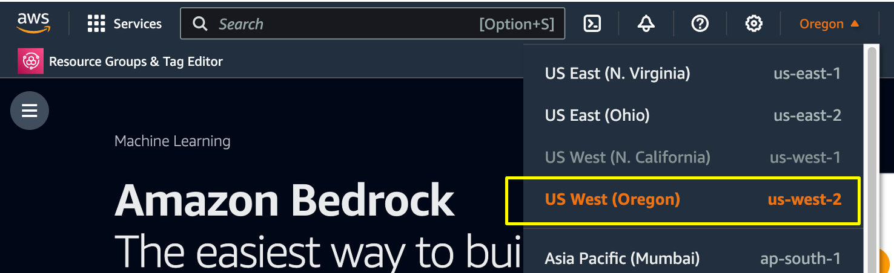
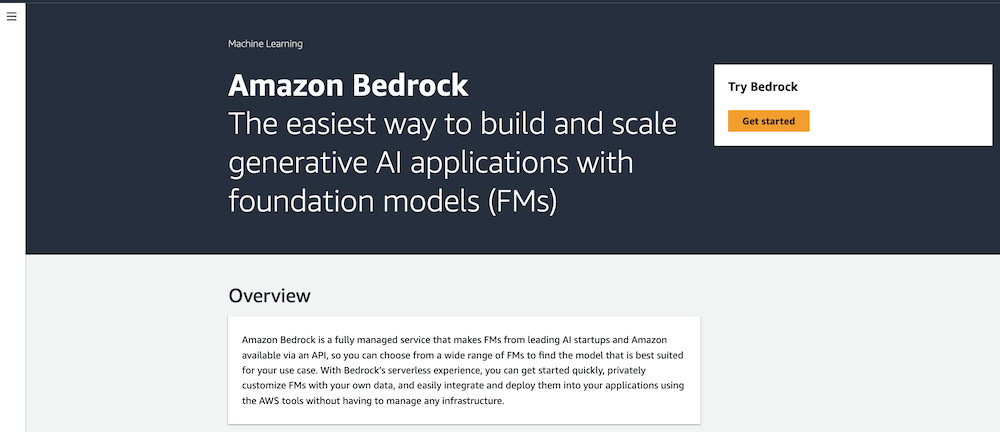
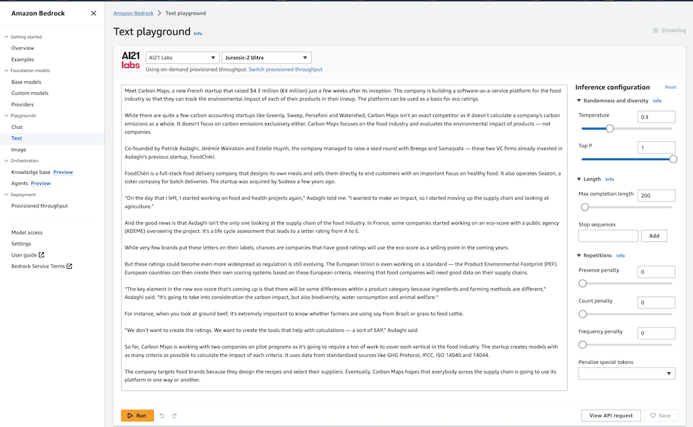

# 1: Bedrock 핸즈온 시작하기

## Bedrock Console 둘러보기
Amazon Bedrock 핸즈온 과정에서 참석해주셔서 감사합니다. 
본격적인 실습에 앞서 Amazon Bedrock 콘솔의 몇 가지 주요 기능에 대해 먼저 살펴보겠습니다.
 

1. Amazon Bedrock에 액세스할 수 있는 계정에 로그인하고 US West (Oregon) 리전을 선택합니다.

  
2. 다음 Amazon Bedrock 콘솔로 이동해서 **Get Started**를 선택합니다.

Amazon Bedrock Console은 다양한 모델, 프롬프트 및 추론 매개변수를 실험해 볼 수 있는 좋은 방법 중 하나입니다. 몇 분만 시간을 내어 콘솔의 다른 기능을 살펴보세요.

* **Getting started(시작하기)** - 탐색 창의 시작하기에서 Amazon Bedrock이 제공하는 파운데이션 모델, 예시 및 플레이그라운드에 대한 개요를 확인할 수 있습니다. Amazon Bedrock 모델에서 사용할 수 있는 프롬프트의 예시도 확인할 수 있습니다.

* **Foundation models(파운데이션 모델)** - 탐색 창의 파운데이션 모델에서 사용 가능한 기본 모델을 보고 다양한 속성별로 모델을 그룹화할 수 있습니다. 모델 보기를 필터링하고, 모델을 검색하고, 모델 제공업체에 대한 정보를 볼 수도 있습니다.

* **Playgrounds(플레이그라운드)** - 콘솔 플레이그라운드를 통해 애플리케이션에서 모델을 사용하기로 결정하기 전에 모델을 실험해 볼 수 있습니다. 

  * 채팅 플레이그라운드 - Amazon Bedrock에서 제공하는 채팅 모델을 실험해 볼 수 있습니다.
  * 텍스트 플레이그라운드 - Amazon Bedrock에서 제공하는 텍스트 모델을 실험해 볼 수 있습니다. 
  * 이미지 플레이그라운드 - Amazon Bedrock에서 제공하는 이미지 모델을 실험해 볼 수 있습니다.

* **Safeguards(안전 가드)** - Gen AI 애플리케이션에서 필요한 안전 가드를 구성할 수 있습니다.

* **Orchestration(오케스트레이션)** - Amazon Bedrock을 사용하면 지식 기반을 활용해 LLM의 추론 기능을 사용하여 컨텍스트에 따라 애플리케이션을 구축하는 방식을 통해 검색 증강 생성(RAG)ß 워크플로를 활성화할 수 있습니다.  

* **Assessment & deployment(평가 및 배포)** - 모델 평가를 사용하면 모델 출력을 평가 및 비교한 다음 애플리케이션에 가장 적합한 모델을 선택할 수 있습니다. 

* **Model access(모델 액세스)** - Amazon Bedrock에서 모델을 사용하려면 먼저 모델에 대한 액세스 권한을 요청해야 합니다. 기본 탐색 창에서 모델 액세스를 선택합니다. 

1. 왼쪽 메뉴에서 Foundation models > Base models 를 클릭하여 Bedrock에서 어떠한 모델들이 제공되는지 확인합니다. 

Amazon Bedrock에서 지원하는 모델들

* AI21 Labs - Jurassic-2 Ultra v1, Jurassic-2 Mid v1
* Amazon - Titan Text Express, Lite, Embeddings, Multimodal Embeddings, Image Generator(preview)
* Anthopic - Claude v1.x, v2.x, Instance v1.x
* Cohere - Command v14.x, Command Light v14.x, Embed English v3.x, Embed Multilingual v3.x
* Meta - Llama 2 Chat 13B v1, Llama 2 13B v1, Llama 2 70B v1
* Stability.ai - Stable Diffusion XL v0.8, v1.x

# 2. Model access 추가하기

기본적으로 User나 Roles는 Amazon Bedrock 리소스를 생성하거나 변경할 수 있는 권한을 가지고 있지 않습니다. AWS 콘솔이나 CLI, API 등을 수행할 수 없음을 의미합니다. 사용자에게 리소스에 접근 권한을 주려면 IAM 관리자가 IAM policies를 만들고 이를 역할을 추가함으로써, 사용자가 assume roles을 할 수 있게 해야 합니다. 

TODO: 모델 액세스 추가하는 과정 설명 및 이미지 추가

이에 대해 더 자세히 알고 싶으면 아래 문서 내용을 참고하시기 바랍니다. 

Identity-based policy examples for Amazon Bedrock 
https://docs.aws.amazon.com/bedrock/latest/userguide/security_iam_id-based-policy-examples.html

# 3. 예제 실행해보기

1. **Amazon Bedrock** 사이드 메뉴를 열고 Examples를 선택합니다.

각 예제에서 프롬프트, 추론 구성, 샘플 응답 및 API 요청 세부 정보를 확인할 수 있습니다.

2. 예제를 선택한 다음 Open in Playground 를 선택하면 예제가 실제로 작동하는 모습을 볼 수 있습니다.

 
3. **Run** 을 선택하고 응답을 검토합니다.

**Temperature** 매개변수를 사용하면 응답을 구성할 때 모델이 보다 "창의적"으로 응답할 수 있습니다. 온도가 0이면 무작위성이 없으며 매번 가장 가능성이 높은 단어가 선택됩니다. 응답의 다양성을 높이려면 Temperature 값을 더 높게 설정하고 동일한 요청을 여러 번 실행할 수 있습니다.
**Response length** 매개변수는 응답에 반환할 토큰의 수를 결정합니다. 이를 사용하여 모델에서 반환되는 콘텐츠의 양을 줄이거나 늘릴 수 있습니다. 길이를 너무 낮게 설정하면 응답이 완료되기 전에 끊어질 수 있습니다.
**Info** 링크를 통해 각 파라미터에 대한 설명을 확인할 수 있습니다.

 
4. **View API request** 를 선택하면 지정된 프롬프트 및 구성에 대한 JSON 페이로드를 확인할 수 있습니다.
 

