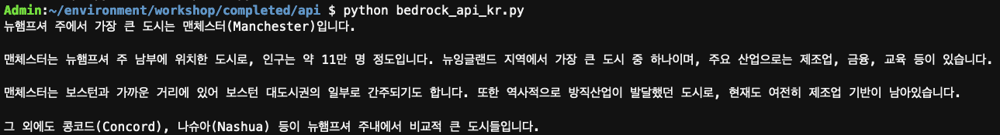
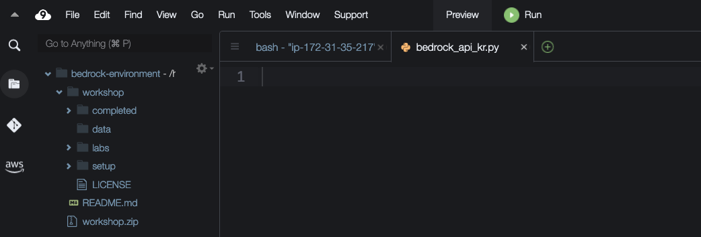

# 실습 2: Bedrock API

## 실습 소개
**최종 결과물:**

이 실습에서는 Bedrock에 직접 기본 API 호출을 하는 방법을 보여드리겠습니다.
아래 코드 스니펫을 복사하여 지정된 Python 파일에 붙여넣어 애플리케이션 코드를 빌드할 수 있습니다.

## Python script 생성
 
1. workshop/labs/api 폴더로 이동하여 bedrock_api_kr.py 파일을 엽니다.

2. import 구문을 추가합니다.
o 이 구문을 사용하면 AWS boto3 라이브러리를 사용하여 Amazon Bedrock을 호출할 수 있습니다.
o 아래 상자의 복사 버튼을 사용하면 해당 코드를 자동으로 복사할 수 있습니다:

~~~python
import json
import boto3
~~~
 
3. Bedrock client 라이브러리를 초기화합니다.
o 아래의 코드를 통해 Bedrock client가 생성됩니다.
~~~python
session = boto3.Session()
bedrock = session.client(service_name='bedrock-runtime') #Bedrock client 생성
~~~

4. API 호출을 위한 payload를 생성합니다.
o 여기서는 사용할 모델, 프롬프트 및 지정된 모델에 대한 추론 매개 변수를 식별합니다.
~~~python
bedrock_model_id = "anthropic.claude-3-sonnet-20240229-v1:0" #파운데이션 모델 설정

prompt = "뉴햄프셔에서 가장 큰 도시가 어디인가요?" #모델에 보낼 프롬프트 설정

body = json.dumps({
    "anthropic_version": "bedrock-2023-05-31",
    "max_tokens": 1024, 
    "temperature": 0,
    "messages": [
                {
                    "role": "user",
                    "content": [
                        {
                            "type": "text",
                            "text": prompt 
                        }
                    ]
                }
            ],
}) #요청 payload 설정
~~~

5. Bedrock API를 호출합니다.
o 호출을 위해 Bedrock의 invoke_model 함수를 사용합니다.
~~~python
response = bedrock.invoke_model(body=body, modelId=bedrock_model_id) #payload를 Bedrock으로 전송
~~~

6. 응답을 표시합니다.
o 모델의 응답 JSON에서 반환된 텍스트를 추출하여 프린트합니다.
~~~python
response_body = json.loads(response.get('body').read()) # response 읽기
results = response_body.get("content")[0].get("text")

print(results)
~~~
 

7. 파일을 저장합니다.
훌륭합니다! 이제 스크립트를 실행할 준비가 되었습니다!

 
## 스크립트 실행
1. AWS Cloud9에서 bash terminal을 선택하고 디렉터리를 변경합니다.
~~~bash
cd ~/environment/workshop/labs/api
~~~
 
2. 터미널에서 스크립트를 실행합니다.
~~~bash
python bedrock_api_kr.py
~~~
 
3. 결과가 터미널에 표시되어야 합니다.

