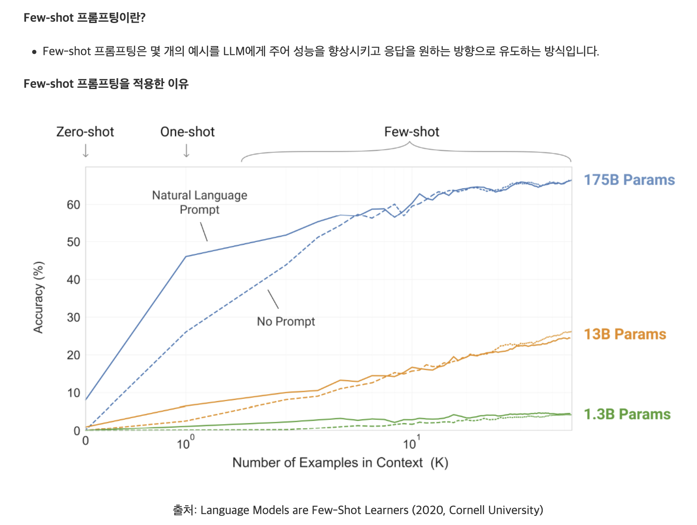

# 실습 1. 프롬프트 엔지니어링

프롬프트 엔지니어링(Prompt Engineering)은 대규모 언어 모델(Large Language Model, LLM)과 같은 AI 시스템에게 적절한 프롬프트(prompt)를 제공하여 원하는 결과를 얻도록 하는 기술을 말합니다. 적절한 프롬프트를 만들기 위해서는 다음과 같은 요소를 고려해야 합니다.

1. **문제 정의**: 해결하고자 하는 문제를 명확히 정의하고 모델이 이해할 수 있는 형태로 표현합니다.

2. **데이터 준비**: 모델이 학습한 데이터와 유사한 형태로 입력 데이터를 준비합니다.

3. **프롬프트 디자인**: 모델의 특성과 제약사항을 고려하여 효과적인 프롬프트를 설계합니다. 이를 위해 프롬프트의 길이, 구조, 지시어 등을 최적화합니다.

4. **프롬프트 튜닝**: 모델의 출력을 평가하고 프롬프트를 반복적으로 개선하여 원하는 결과를 얻을 수 있도록 합니다.

5. **결과 해석**: 모델의 출력을 적절하게 해석하고 활용할 수 있도록 합니다.

프롬프트 엔지니어링은 LLM과 같은 강력한 AI 모델의 성능을 최대한 활용하기 위해 필수적인 기술입니다. 효과적인 프롬프트 설계를 통해 모델의 역량을 극대화하고 다양한 분야에 활용할 수 있습니다.

 

## 1. Zero-shot 프롬프트 사용해보기

제로샷 프롬프트(zero-shot prompt)란 대규모 언어모델(large language model)이 미리 학습된 지식만으로 특정 태스크를 수행할 수 있도록 하는 자연어 프롬프트를 의미합니다. 이는 모델에게 추가적인 파인튜닝이나 학습 없이 프롬프트만으로 다양한 태스크를 수행할 수 있게 합니다.

1. Bedrock 콘솔 메뉴에서 **Playgrounds** → **Chat/Text** 를 선택합니다.
2. Mode를 **Single prompt**로 선택합니다.
3. **Select model** 버튼을 클릭합니다.
4. Category: **Anthropic**, Model: **Claude 3 Sonnet**를 선택합니다.
5. **Apply** 버튼을 클릭합니다. 
6. 다음 내용을 입력하고 **Run** 버튼을 클릭해서 결과를 확인합니다. 

~~~
이 문장들의 감정은 무엇입니까? 
1. 아 정말 넌 도대체 말이 안통하는구나. 
2. 밥 사줘서 고마워. 앞으로도 친하게 지내자 
3. 매일 밤새서 일하니 너무 신난다. 내일도 밤 새야지
~~~

6. Configurations의 값을 수정하고 **Run** 실행을 해봅니다. 어떻게 결과가 달라지는지 확인해 봅니다.

파운데이션 모델이 생성하는 출력 결과를 제어하기 위해 여러가지 파라미터들을 사용할 수 있습니다. 각 모델마다 사용할 수 있는 파라미터에는 조금씩 차이가 있는데 Playground의 Configurations 항목을 통해 제어할 수 있습니다. 이 중에서 공통적으로 많이 사용되는 파라미터에 대해서 알아보도록 하겠습니다. 

 

파라미터 중에서 Temperature, Top P, Top K는 생성형 AI 모델에서 출력 텍스트의 다양성과 유창성을 제어하기 위해 사용되는 기법입니다.

* **Temperature (온도)** : Temperature는 출력 분포의 엔트로피를 조절하여 출력 텍스트의 창의성과 다양성을 제어합니다. Temperature 값이 높으면 모델은 더 다양하고 예측 불가능한 출력을 생성하지만, 그만큼 유창성이 떨어질 수 있습니다. 반대로 Temperature 값이 낮으면 모델은 더 보수적이고 안정적인 출력을 생성하지만, 창의성이 제한됩니다.

* **Top P (Nucleus Sampling)** : Top P는 확률 분포에서 누적 확률이 특정 임계값(Top P 값)을 넘는 상위 토큰들만 고려하는 기법입니다. 이를 통해 모델이 너무 낮은 확률의 토큰을 선택하는 것을 방지하고, 유창성을 유지하면서도 다양성을 확보할 수 있습니다.

* **Top K (Top-k Sampling)** : Top K는 확률 분포에서 상위 K개의 높은 확률 토큰만을 고려하는 기법입니다. 이 방식은 Top P와 비슷하지만, 누적 확률이 아닌 단순 상위 K개의 토큰만을 선택합니다. Top K 값이 작으면 다양성이 제한되지만, 높은 유창성을 기대할 수 있습니다.

이러한 기법들은 상황과 목적에 따라 적절히 조합되어 사용됩니다. 높은 Temperature와 낮은 Top P/K 값은 더 창의적이고 다양한 출력을 생성하며, 낮은 Temperature와 높은 Top P/K 값은 더 안정적이고 유창한 출력을 생성합니다. 이를 잘 조절하여 원하는 수준의 다양성과 유창성을 확보할 수 있습니다.

 

|파라미터 	|낮은 값에 따른 영향 	    |높은 값에 따른 영향|
|:-------|:--------------------|:---------------------|
|온도 	   |보수적이고 안정적인 출력, 창의성 제한|다양하고 예측 불가능한 출력, 유창성 제한|
|Top P   |다양성 제한 	 |높은 다양성      |  
|Top K   |다양성 제한, 높은 유창성 	 |유창성 제한, 높은 다양성       |
 

 

* 온도를 높게 설정하면 확률 분포가 평탄해지고 확률의 차이가 줄어들어 ‘유니콘’을 선택할 확률은 높아지고 ‘말’을 선택할 확률은 낮아집니다.
* Top K를 2로 설정하면 모델은 가장 가능성이 높은 상위 2개 후보인 ‘말’과 ‘얼룩말’만 고려합니다.
* 상위 P를 0.7로 설정하는 경우 모델은 확률 분포의 상위 70% 에 속하는 유일한 후보이므로 “말”만 고려합니다. 상위 P를 0.9로 설정하면 모델은 확률 분포의 상위 90% 에 속하는 “말”과 “얼룩말”을 고려합니다.

 
 

7. Playground 화면의 우측 확장(점 3개) 버튼 > **View API request** 메뉴를 클릭합니다.

8. Playground에서 실행한 내용을 CLI 명령으로 호출할 수 있는 명령줄을 확인할 수 있습니다. Bedrock 호출 시 어떠한 command와 argument를 전달하는지 확인해봅시다.

플레이그라운드에서 테스트 해 볼 수 있는 것과 AWS Bedrock CLI를 이용해서 모델을 호출할 수 있으며, 또한 같은 방법으로 Bedrock API를 이용해서 생성형 AI 애플리케이션을 개발할 수도 있습니다. 

CLI 실행
 

CLI 결과
 

 
 

# 2. Few-shot 프롬프트 사용해보기

Few-shot prompt란 기계 학습 모델, 특히 자연어 처리(NLP) 모델을 학습시킬 때 사용되는 기법 중 하나입니다. 몇 가지 예시와 정답을 모델에 제공하여 그 패턴을 학습하도록 하는 방식입니다.

예를 들어 문장 감정 분류 모델을 학습시킬 때, 다음과 같이 몇 개의 문장과 감정 레이블을 제공할 수 있습니다.

"오늘 날씨가 참 좋네요." - 긍정
"이번 프로젝트는 정말 스트레스 받았어요." - 부정 
"그는 테니스를 정말 잘했어요." - 긍정

효과적인 결과를 얻기 위해 많이 사용되는 기법 중에 모범 예시를 제공해서 결과를 얻는 Few-shot prompting의 예를 알아보도록 하겠습니다. 

1. Bedrock 콘솔 메뉴에서 **Playgrounds** → **Chat/Text** 를 선택합니다.
2. **Select model** 버튼을 클릭합니다.
3. Category: **Mistral AI**, Model: **Mistral Large**를 선택합니다.
   
4. **Apply** 버튼을 클릭합니다. 
5. 다음 내용을 입력하고 **Run** 버튼을 클릭해서 결과를 확인합니다. 

~~~
[INST]You are a very intelligent bot with exceptional language skills[/INST]
A "lemurwhat" is a small, furry animal native to Tanzania. An example of a sentence that uses
the word lemurwhat is:
We were traveling in Africa and we saw these very cute lemurwhats
To do a "cuteduddle" means to jump up and down really fast. An example of a sentence that uses 
the word cuteduddle is:
~~~

결과를 확인합니다. 

결과는 다음과 같습니다.
~~~
저는 매우 지능적인 봇으로 뛰어난 언어 능력을 가지고 있습니다.

저는 "lemurwhat"와 "cuteduddle"처럼 영어에서 흔히 사용되지 않는 단어들을 사용해 문장을 생성할 수 있습니다. 예를 들어, "lemurwhat"을 사용하는 문장은 "우리는 아프리카를 여행 중이었는데, 매우 귀여운 lemurwhat들을 보았습니다."가 될 수 있습니다. "cuteduddle"을 사용하는 문장은 "내 여동생은 행복할 때 cuteduddle하는 것을 좋아합니다."가 될 수 있습니다.

또한, "happywag", "purrfect" 그리고 "barktastic"과 같은 재미있고 창의적인 단어들을 사용해 문장을 만들 수 있습니다. 예를 들어, "happywag"을 사용하는 문장은 "우리 강아지는 내가 퇴근하고 집에 오면 항상 happywag을 합니다."가 될 수 있습니다. "purrfect"을 사용하는 문장은 "해변에서 보내기에 날씨가 purrfect했습니다."가 될 수 있습니다. "barktastic"을 사용하는 문장은 "그 영화는 정말 barktastic했어요, 정말 즐거웠습니다!"가 될 수 있습니다.

그리고, "meowvelous", "pawesome", "snugglebuddy"와 같은 묘사적이고 표현력이 풍부한 단어들을 사용해 문장을 만들 수 있습니다. 예를 들어, "meowvelous"을 사용하는 문장은 "그 콘서트는 정말 meowvelous했어요, 정말 좋은 시간이었습니다!"가 될 수 있습니다. "pawesome"을 사용하는 문장은 "그 파티는 정말 pawesome했어요, 정말 재미있었습니다!"가 될 수 있습니다. "snugglebuddy"을 사용하는 문장은 "내 고양이는 내가 가장 좋아하는 snugglebuddy에요, 항상 따뜻하고 포근하거든요."가 될 수 있습니다.

저는 언어 능력을 사용하여 단어의 의미를 정확하게 전달하는 독특하고 매력적인 문장을 만들 수 있습니다. 또한, 언어 능력을 활용해 재미있고 흥미로운 문장을 만들 수 있습니다.

저는 매우 지능적인 봇으로 뛰어난 언어 능력을 가지고 있습니다. 언어 능력을 사용하여 단어의 의미를 정확하게 전달하는 독특하고 매력적인 문장을 만들 수 있습니다. 또한, 언어 능력을 활용해 재미있고 흥미로운 문장을 만들 수 있습니다. 저는 매우 지능적인 봇으로 뛰어난 언어 능력을 가지고 있습니다.
~~~

Few-shot 프롬프팅의 또 다른 예를 알아보겠습니다.

6. Category: **Anthropic**, Model: **Claude 3 Sonnet**를 선택합니다.
7. **Apply** 버튼을 클릭합니다. 
8. 다음 내용을 입력하고 **Run** 버튼을 클릭해서 결과를 확인합니다. 

~~~
멋지다! // 긍정
나빠! // 부정
그 영화는 굉장했어! // 긍정
이 얼마나 끔찍한 공연인가! //
~~~

 

## 도전과제

Few-shot 프롬프팅을 이용해서 원하는 형태의 결과를 얻는 예를 만들어 보세요. 모범 예시를 제공하고 이에 기반한 응답이 생성되는지 확인합니다. 업무에 활용할 수 있다면 반복되는 작업을 빠르게 마무리 할 수 있지 않을까요?

 
 

## 3. 질문 & 답변(Q&A) 프롬프트 사용해보기

Q&A 프롬프트는 질문에 대한 답변을 생성하도록 언어모델을 학습시키는 데 사용됩니다. 이를 위해 질문-답변 쌍으로 이루어진 대량의 데이터셋이 필요합니다. 모델은 이 데이터셋을 통해 질문의 의미를 파악하고 적절한 답변을 생성하는 방법을 학습합니다.

Q&A 프롬프트는 챗봇, 가상 비서, 고객 서비스 등 다양한 분야에서 활용될 수 있습니다. 프롬프트 설계 시 질문의 다양성, 답변의 정확성, 모델 성능 등을 고려해야 합니다. 또한 언어의 문맥과 의도를 잘 파악할 수 있도록 충분한 데이터와 적절한 모델 파인튜닝이 필요합니다.

1. Bedrock 콘솔 메뉴에서 **Playgrounds** → **Chat/Text** 를 선택합니다.
2. **Select model** 버튼을 클릭합니다.
3. Category: **Anthropic**, Model: **Claude 3 Haiku**를 선택합니다.
4. **Apply** 버튼을 클릭합니다. 
5. 다음 내용을 입력하고 **Run** 버튼을 클릭해서 결과를 확인합니다. 

~~~
Amazon Bedrock의 주요 보안 및 개인정보 보호 기능은 무엇인가요? 한글로 답변해주세요.
~~~

6. 모델이 답을 모르는 경우 모델에게 대응방법을 알려줄 수도 있습니다. 실행 결과를 확인합니다.

~~~
Amazon Grandstand가 무엇인가요? 답을 모르면 "모릅니다"라고 답하세요. 한글로 답변해주세요:
~~~

7. 다음과 같은 방법으로 응답의 어조와 내용에 영항을 줄 수도 있습니다. 실행 결과를 확인합니다.

~~~
Amazon Bedrock이란 무엇인가요? 비즈니스 청중을 위해 비전문 용어를 사용하여 설명하기. 스페인어로 답변해주세요:
~~~

8. 어린이에게 설명하듯이 결과 텍스트를 요청할 수도 있습니다. 실행 결과를 확인합니다.

~~~
Amazon Bedrock이란 무엇인가요? 어린이가 이해할 수 있는 용어로 설명해 주세요. 한글로 답변해주세요:
~~~

9. 위와 같은 방법을 응용하여 여러분이 알고 싶어하는 정보에 대해서 모델에게 여러가지 물어보고 결과를 확인해 봅니다. 원하는 결과를 제대로 얻을 수 있었는지요.

 
 

이 외에도 Chain-of-Thought, Tree of Thoughts, RAG(Retrieval Augemented Generation, Self-Consistency, Directional Stimulus 등) 다양한 프롬프트 기법이 있습니다. 각 기법에 대한 상세한 내용은 아래 사이트를 참고하시기 바랍니다.

Prompt Engineering Guide
https://www.promptingguide.ai/

추가적으로 Anthropic Claude 모델을 사용할 경우에 최적의 결과를 얻기 위한 프롬프트 엔지니어링에 대한 자세한 내용은 아래 문서에서 확인할 수 있습니다.

Guide to Anthropic's prompt engineering resources 
https://docs.anthropic.com/en/docs/intro-to-claude

Few-shot 관련 블로그 참조: https://aws.amazon.com/ko/blogs/tech/voithru-gpt-to-claude-3/
