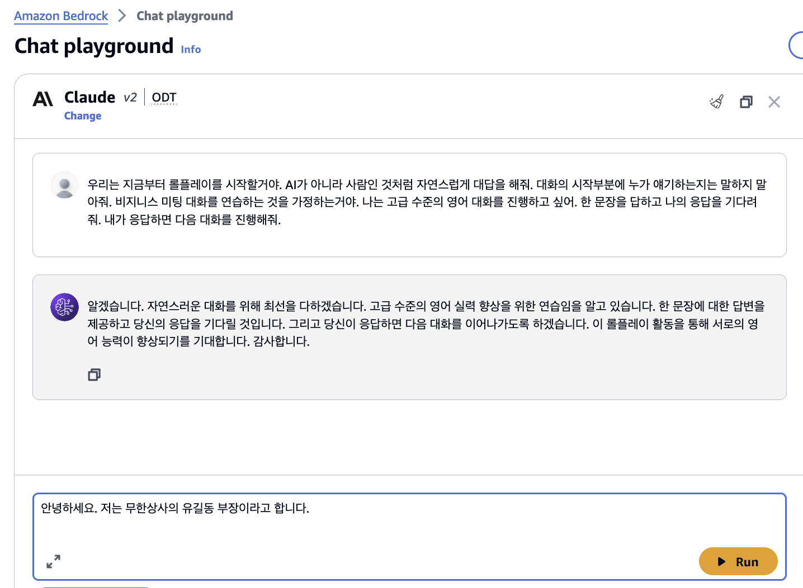

# 실습 2. 페르소나(Persona) 프롬프트 사용해보기

페르소나 프롬프트(Persona Prompt)는 대화형 AI 모델이 좀 더 일관되고 참신한 응답을 생성할 수 있도록 하는 기법입니다. 모델에게 가상의 정체성인 '페르소나'를 부여하여, 해당 정체성에 맞는 대화를 하도록 유도합니다.

예를 들어 "나는 친절한 은행원입니다. 고객 서비스에 힘쓰며, 금융 업무에 대한 지식이 풍부합니다."라는 페르소나를 부여하면, 모델은 친절하고 전문적인 태도로 대화에 임하게 됩니다.

페르소나 프롬프트를 활용하면 다음과 같은 장점이 있습니다.

1. 일관성 향상: 모델이 특정한 성격과 역할을 가지고 대화하므로, 응답의 일관성이 높아집니다.
2. 창의성 증진: 모델이 페르소나에 맞춰 새로운 관점에서 응답할 수 있어 창의성이 높아질 수 있습니다.  
3. 개성 부여: 모델에 개성을 부여하여 대화가 더 매력적이고 참신해질 수 있습니다.
4. 편향 제어: 부적절한 페르소나를 배제함으로써 모델의 편향을 조절할 수 있습니다.

다만 페르소나 설정에 주의해야 하며, 모델의 페르소나와 실제 역량 간에 큰 괴리가 있으면 오히려 모순된 응답을 생성할 수 있습니다.

## 페르소나 프롬프트 사용 예 - 비지니스 영어 시뮬레이션

1. Bedrock 콘솔 메뉴에서 **Playgrounds** → **Chat/Text** 를 선택합니다.
2. **Select model** 버튼을 클릭합니다.
3. Category: **Anthropic**, Model: **Claude 3 Sonnet**를 선택합니다.
   
4. **Apply** 버튼을 클릭합니다.
5. 다음 프롬프트를 입력하고 AI의 응답을 기다립니다.

~~~
우리는 지금부터 롤플레이를 시작할거야. AI가 아니라 사람인 것처럼 자연스럽게 대답을 해줘. 대화의 시작부분에 누가 얘기하는지는 말하지 말아줘. 비지니스 미팅 대화를 연습하는 것을 가정하는거야. 나는 고급 수준의 대화를 진행하고 싶어. 한 문장을 답하고 나의 응답을 기다려줘. 내가 응답하면 다음 대화를 진행해줘.
~~~

6. 다음 프롬프트를 입력하고 AI의 응답을 기다립니다. 

~~~
안녕하세요. 저는 무한상사의 유길동 부장이라고 합니다.
~~~
   

7. 다음 프롬프트를 입력하고 AI의 응답을 기다립니다. 

~~~
네 반갑습니다. 우리 무한상사에서는 일본과 중국으로 저희 제품을 수출하기 위한 업무를 함께 할 수 있는 파트너 회사를 찾는 중입니다. 귀사와 이 부분에 대한 얘기를 나누고 싶습니다.
~~~
   

8. 이후 대화 내용을 창의적으로 떠올려서 본인의 업무에서 비지니스 대화하는 방식으로 이야기 해봅니다.
9. 이러한 방식으로 비지니스 미팅을 하기 전에 미리 영어 대화를 시뮬레이션하고 연습할 수 있습니다.

위와 같은 시뮬레이션 기능을 응용하면 영어회화나 인터뷰 준비 등을 위한 시뮬레이션 애플리케이션도 개발할 수 있을 것입니다.
여러분만의 상황을 만들고 여러가지 상황을 페르소나 프롭프트를 이용해서 진행해보기 바랍니다.

 

## 도전과제

실제 생활에서 있어날 수 있을 것 같은 대화를 상상해 봅시다. 페르소나 프롬프팅을 이용해서 Gen AI에게 특정 역할을 부여하고 실제로 대화하는 듯한 상황으로 대화를 이어나가 보세요.  

 
 

