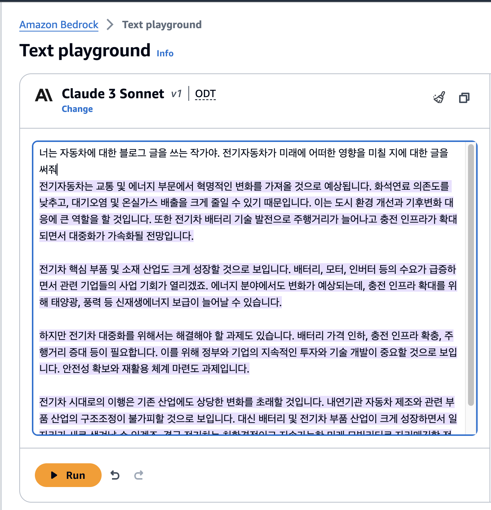
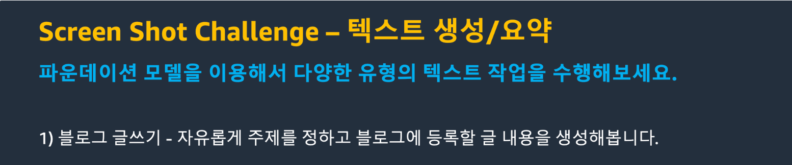
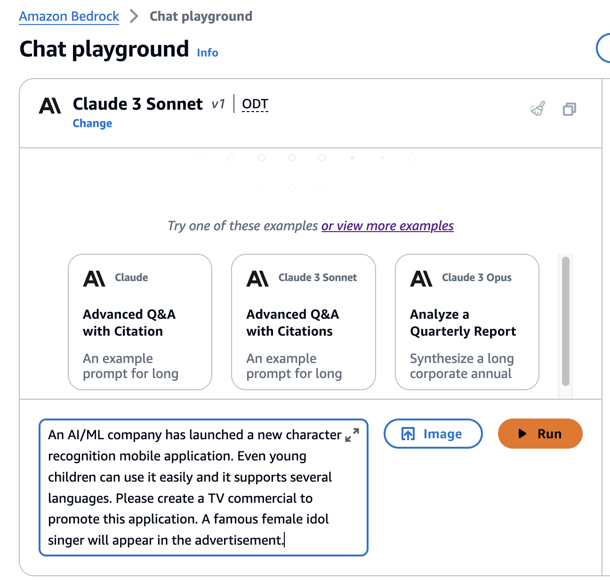
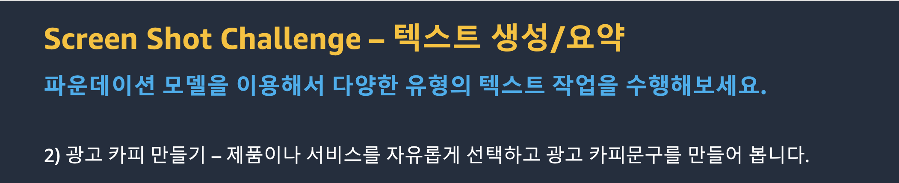
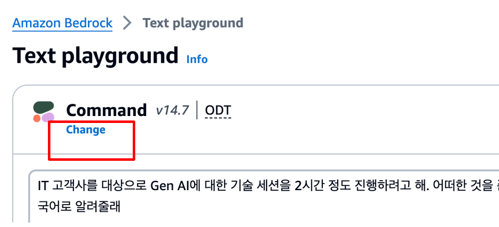
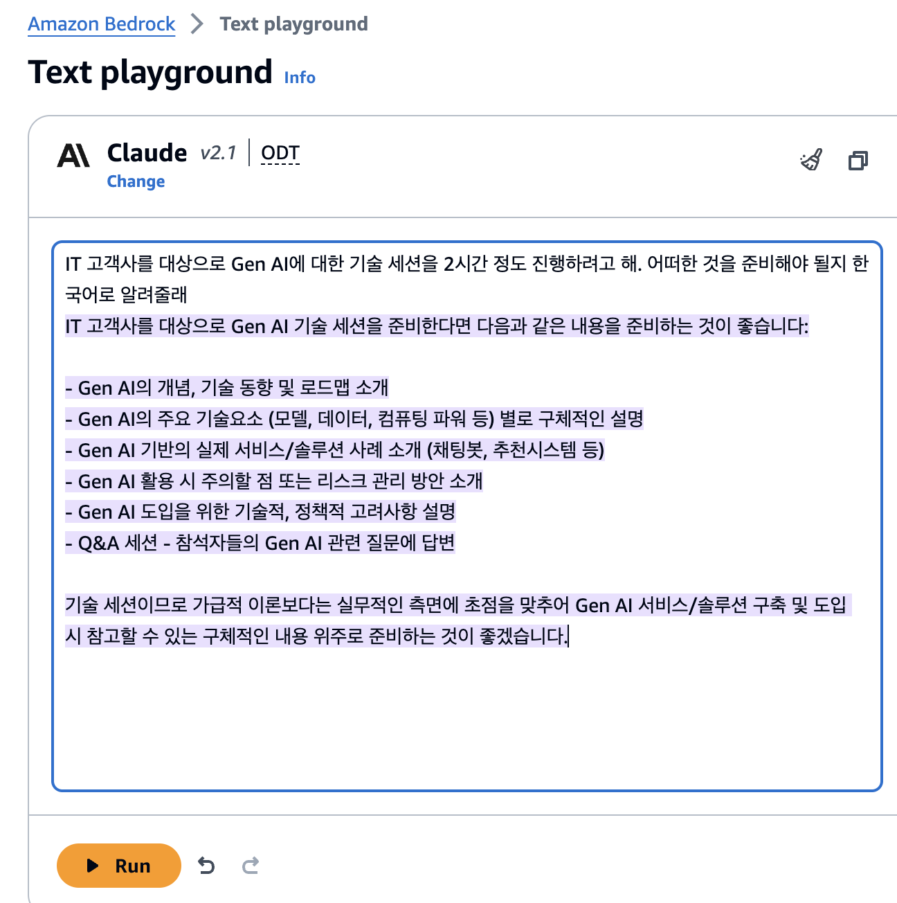
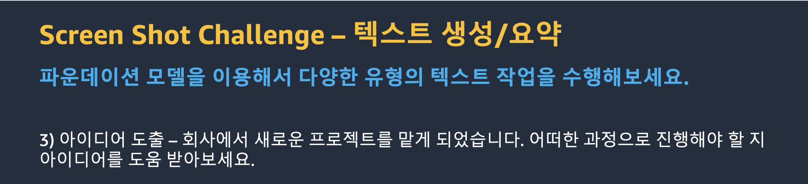

# 실습 1. 텍스트 생성

Gen AI를 이용해서 여러가지 텍스트 컨텐츠를 손쉽게 만들어 낼 수 있습니다. 보고서를 작성하거나 프로젝트를 수행할 때 아이디어를 얻는 등 다양한 작업에 사용할 수 있습니다. 여러가지 활용 사례를 실습을 통해서 알아보도록 하겠습니다. 

## 1. 블로그 글쓰기

1. Bedrock 콘솔 메뉴에서 **Playgrounds** → **Text** 를 선택합니다.
2. **Select model** 버튼을 클릭합니다.
3. Category: **Anthropic**, Model: **Claude 3 Sonnet**를 선택합니다.
4. **Apply** 버튼을 클릭합니다. 
5. 다음 내용을 입력하고 **Run** 버튼을 클릭해서 결과를 확인합니다. 

~~~
너는 자동차에 대한 블로그 글을 쓰는 작가야. 전기자동차가 미래에 어떠한 영향을 미칠 지에 대한 글을 써줘
~~~

6. 기존 텍스트 내용을 지우고 다음과 같이 프롬프트를 변경합니다.
7. **Run** 버튼을 클릭해서 결과를 확인합니다. 

~~~
선생님이 초등학생에게 설명해주는 듯한 형식으로 전기자동차가 미래에 어떠한 영향을 미칠 지에 대한 글을 써줘
~~~

8. 결과가 어떻게 달라졌는지 비교해봅니다.
9. 위와 같은 방법으로 다른 역할을 부여해보고 생성되는 텍스트가 어떻게 바뀌는지 확인해보세요.

 

## 도전과제

개인 블로그에 글을 올리려고 합니다. 본인만의 취미나 관심사에 대한 주제를 자유롭게 정하고 텍스트 생성 기능을 이용해서 블로그 내용을 생성합니다. 원하는 느낌이나 문체(tone and manner)에 맞게 다양한 방법으로 프롬프트를 실행해 보세요. 

 
 

## 2. 광고 카피 만들기

1. 위 실습과 같은 방법으로 다음과 같이 프롬프트를 실행해서 결과를 알아봅니다. 
2. Category: **Amazon**, Model: **Titan Text G1 - Lite v1**

~~~
An AI/ML company has launched a new character recognition mobile application. Even young children can use it easily and it supports several languages. Please create a TV commercial to promote this application. A famous female idol singer will appear in the advertisement.
~~~

3. Model: **Titan Text G1 - Express v1** 으로 변경 후 다시 실행해 봅니다. 
4. 실행 결과가 어떻게 다른지 확인해 봅시다.

5. Bedrock 콘솔 메뉴에서 **Playgrounds** → **Text** 를 선택합니다.
6. **Select model** 버튼을 클릭합니다.
7. Category: **Anthropic**, Model: **Claude 3 Sonnet**를 선택합니다.
8. **Apply** 버튼을 클릭합니다. 
9. 다음 내용을 입력하고 **Run** 버튼을 클릭해서 결과를 확인합니다. 

10.  **Playground** 에서 **Chat** 을 선택합니다.
11.  **Select model** 버튼을 클릭합니다.
12. Category: **Anthropic**, Model: **Claude 3 Sonnet**를 선택합니다.
13. **Apply** 버튼을 클릭합니다.
~~~
An AI/ML company has launched a new character recognition mobile application. Even young children can use it easily and it supports several languages. Please create a TV commercial to promote this application. A famous female idol singer will appear in the advertisement.
~~~

15.  채팅창에 다음을 입력하고 **Run** 버튼을 클릭해서 결과를 확인합니다.

~~~
한글로 바꿔줘
~~~

15. 응답 결과가 어떻게 바뀌었는지 확인해 봅시다.
16. chat 기능을 이용하면 이전 대화내용에 대한 컨텍스트를 기억하고 있으므로 이전 응답에 대해 변경을 요청할 수 있습니다. 
    채팅창에 다음을 입력하고 **Run** 버튼을 클릭해서 결과를 확인합니다.

~~~
조금 짧게 써줄래
~~~

## 도전과제

회사에서 새로운 제품이나 서비스가 출시되었습니다. 자유롭게 아이템을 선택하고 광고 카피문구를 만들어 봅시다. 다양한 고객층으로 바꿔가며 적절한 대상 고객에 맞게 광고 카피가 만들어지는지 확인해봅시다. 라디오 광고, TV 광고, 인터넷 광고 등 매체를 변경해보는 것도 좋습니다.

 
 

## 3. 아이디어 도출

1. Bedrock 콘솔 메뉴에서 **Playgrounds** → **Text** 를 선택합니다.
2. **Select model** 버튼을 클릭합니다. 
3. Category: **Cohere**, Model: **Command**
4. 다음 내용을 입력하고 **Run** 버튼을 클릭해서 결과를 확인합니다.
   
~~~
IT 고객사를 대상으로 Gen AI에 대한 기술 세션을 2시간 정도 진행하려고 해. 어떠한 것을 준비해야 될지 알려줄래
~~~
5. 결과를 확인해 봅시다. 원하는 결과를 얻을 수 있었나요?

6. 다음과 같이 모델을 변경하고 다시 프롬프트를 실행해서 결과를 알아봅니다.
7. Category: **Anthrophic**, Model: **Claude 2.1**

~~~
IT 고객사를 대상으로 Gen AI에 대한 기술 세션을 2시간 정도 진행하려고 해. 어떠한 것을 준비해야 될지 알려줄래
~~~

8. 결과를 확인해 봅시다. 원하는 결과를 얻을 수 있었나요?

 
 

9. 텍스트 내용을 지우고, 다음 프롬프트를 실행해 봅니다.

~~~
회사내에 직원 분들이 쉬면서 책을 읽을 수 있는 북카페를 만들려고 하는데 어떤 것들을 준비해야 되는지 알려줘
~~~

 

## 도전과제

업무 중에 잘 모르는 분야에 대한 프로젝트를 맡았던 경우를 기억해 봅시다. 어떠한 작업을 어떠한 순서로 해야되는지 Bedrock에서 제공하는 파운데이션 모델을 이용해서 확인해 봅시다.

 
 

이 외에도 Narrative writing, Q&A(chat), Role play 등 다양한 용도로 텍스트 생성을 위해 Gen AI를 사용할 수 있습니다.

