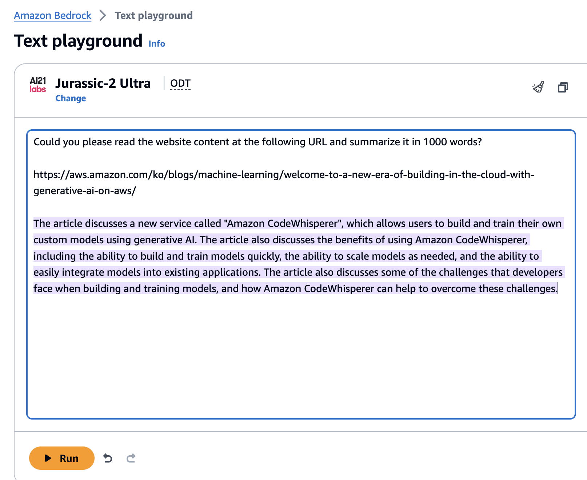
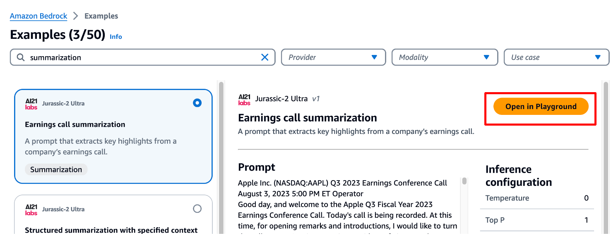
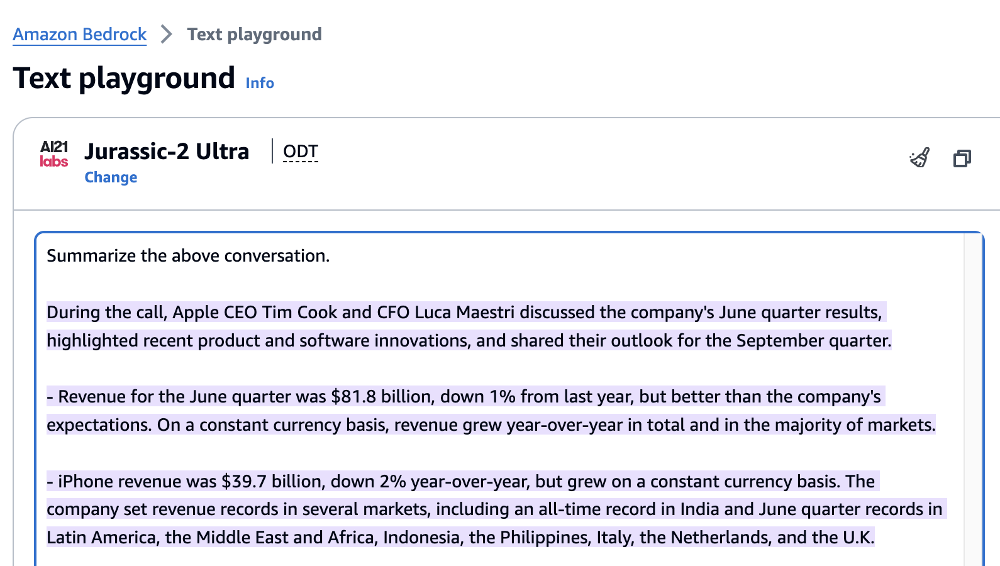
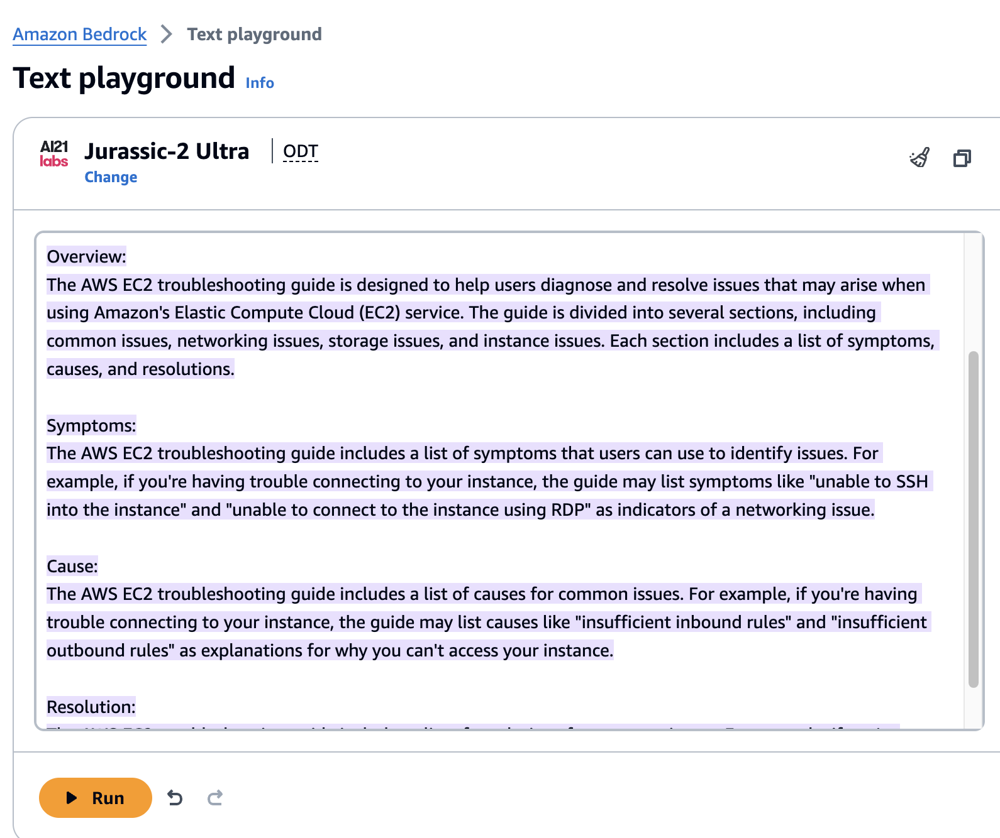
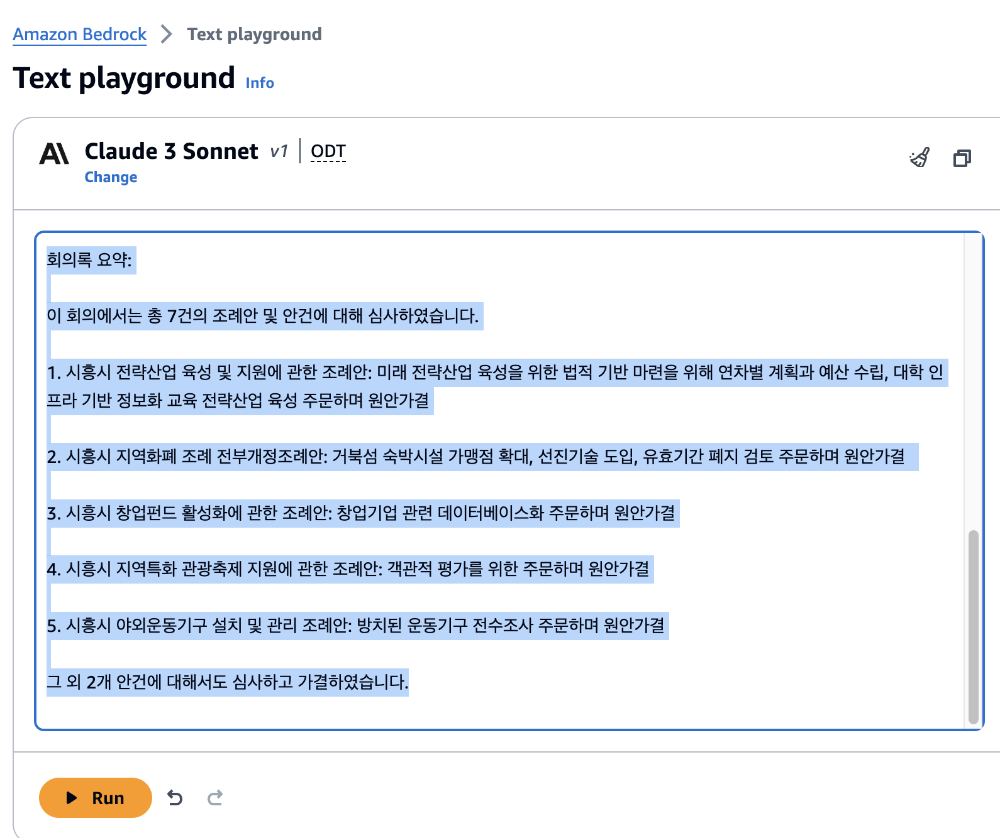

# 실습 2. 텍스트 요약

Gen AI를 이용하면 긴 컨텐츠 내용을 요약하는 것도 간단히 진행할 수 있습니다. 몇 가지 실습 사례를 통해 알아보도록 하겠습니다.

## 1. 기술 블로그 내용 요약

1. Bedrock 콘솔 메뉴에서 **Playgrounds** → **Text** 를 선택합니다.
2. **Select model** 버튼을 클릭합니다.
3. Category: **AI21**, Model: **Jurassic-2 Ultra** 을 선택합니다.
4. **Apply** 버튼을 클릭합니다. 
5. 다음 내용을 입력하고 **Run** 버튼을 클릭해서 결과를 확인합니다. 

~~~
Could you please read the website content at the following URL and summarize it in 1000 words?

https://aws.amazon.com/ko/blogs/machine-learning/welcome-to-a-new-era-of-building-in-the-cloud-with-generative-ai-on-aws/
~~~

6. 다른 URL로 변경해서 실행했을 때 적절하게 요약된 결과를 보여주는지 확인합니다.
   * 예시. AWS Blog : Techniques for automatic summarization of documents using language models
   https://aws.amazon.com/ko/blogs/machine-learning/techniques-for-automatic-summarization-of-documents-using-language-models/

 
 

## 2. Earning call 요약
이 사례에서는 파운데이션 모델의 응답길이를 제어하는 실습을 진행합니다.

* 응답 길이 - 생성된 응답에서 반환할 최소 또는 최대 토큰 수를 지정하는 정확한 값입니다.
* 페널티 - 응답의 출력에 페널티 수준을 지정합니다. 예는 다음과 같습니다.
  * 응답의 길이입니다.
  * 응답에서 토큰이 반복되었습니다.
  * 응답에 포함된 토큰의 빈도입니다.
  * 응답의 토큰 유형입니다.
* 중지 시퀀스 - 모델이 더 이상 토큰을 생성하지 못하도록 하는 문자 시퀀스를 지정합니다. 모델에서 지정한 중지 시퀀스를 생성하는 경우 해당 시퀀스 이후에는 생성이 중지됩니다.

1. Bedrock 콘솔 메뉴에서 **Getting Started** → **Examples** 를 선택합니다.
2. Search in examples 항목에 **summarization**을 입력해서 검색합니다. 
3. 검색 결과에서 **Earning call summarization** 을 선택하고 **Open in Playground** 버튼을 클릭합니다. 

4. **Run** 버튼을 클릭해서 실행된 결과를 확인합니다. 

5. 우측 맨 위의 **Load examples** 에서 **Earning call summarization** 을 다시 로드하거나 Text 창에서 Summarize the above conversation 하위에 요약된 문장을 지웁니다.
6. 우측 Configurations 에서 **Length** 값을 **100**으로 변경합니다.
7. 다시 **Run** 버튼을 클릭해서 결과를 비교해봅시다. 

 
 

## 3. Structured summarization

1. Bedrock 콘솔 메뉴에서 **Playgrounds** → **Text** 를 선택합니다.
2. Select model 버튼을 클릭합니다.
3. Category: **AI21 Labs**, Model: **Jurassic-2 Ultra** 를 선택합니다.
4. **Apply** 버튼을 클릭합니다. 
5. 다음 내용을 입력하고 **Run** 버튼을 클릭해서 결과를 확인합니다. 

~~~
Read the document URL below, write a short and concise article about issue. It should include 5 sections:

1. Overview 2. Symptoms 3. Cause 4. Resolution 5. Resources

https://docs.aws.amazon.com/AWSEC2/latest/UserGuide/TroubleshootingInstances.html
~~~

6. 원문 내용과 요약된 결과를 비교해 봅니다.
7. Configurations 의 여러 파라미터 항목들을 변경해보고 결과를 확인해 봅니다.  

 
 

## 4. 회의록 요약

1. Bedrock 콘솔 메뉴에서 **Playgrounds** → **Text** 를 선택합니다.
2. **Select model** 버튼을 클릭합니다.
3. Category: **Anthropic**, Model: **Claude 3 Sonnet** 를 선택합니다.
4. **Apply** 버튼을 클릭합니다. 
5. 다음 내용을 입력하고 **Run** 버튼을 클릭해서 결과를 확인합니다. 

~~~
아래 회의록 내용을 읽고 내용을 요약해줘.
####
(11시 48분)
○의장 송미희 의사일정 제5항 「시흥시 전략산업 육성 및 지원에 관한 조례안」부터 의사일정 제11항 「2024년 정기분 공유재산관리계획안」까지 이상 7건의 안건을 일괄 상정합니다.
자치행정위원회 위원장이신 박춘호 의원님 나오셔서 자치행정위원회 소관 안건에 대한 심사 결과를 보고하여 주시기를 바랍니다.
○자치행정위원장 박춘호 자치행정위원회 위원장 박춘호입니다.
제312회 시흥시의회(제2차 정례회) 회기 중 자치행정위원회에서는 총 7건의 조례 및 기타 안건에 대해서 심사하였습니다.
먼저 「시흥시 전략산업 육성 및 지원에 관한 조례안」에 대한 심사 결과입니다.
본 안건은 미래 전략산업의 체계적인 육성과 지원을 위한 법적·제도적 기반을 마련하고자 하는 사안으로 중장기적 관점에서 시흥시 전략산업에 대한 연차별 계획과 예산을 수립해 주실 것과 관내 대학의 인프라를 기반으로 정보화 교육을 전략산업으로 육성하는 방향에 대해 적극적인 검토를 주문하며 원안대로 의결하였습니다.
본 안건은 행정안전부의 종합 지침에 따라 시흥화폐 가맹점 등록 기준 등 조례 내용을 정비하는 사안으로 거북섬 내 숙박 시설 등을 대상으로 시루 가맹점을 확장하는 데 적극적으로 노력해 주실 것과 지역화폐 발행과 잔고 활용에 있어 선진적 기술 도입을 주문합니다.
아울러 유효기간이 경과한 지역화폐로 인해 피해를 보는 시민이 생기지 않도록 유효 기간을 폐지하는 부분에 대해 적극적으로 검토해 주실 것을 주문하며 원안대로 의결하였습니다.
다음은 「시흥시 창업펀드 활성화에 관한 조례안」에 대한 심사 결과입니다.
본 안건은 시흥시 창업펀드 조성 및 운용으로 시흥시 창업 생태계 활성화에 이바지하고자 하는 사안으로 관내 창업 기업에 관련된 객관적 지표를 데이터베이스화 해 주실 것을 주문하며 원안대로 의결하였습니다.
다음은 「시흥시 지역특화 관광축제 지원에 관한 조례안」에 대한 심사 결과입니다.
본 안건은 시민 주도형 관광 축제를 지원하여 주민 화합과 시흥시 주요 관광 명소를 알리고 지역특화 관광축제 육성과 지역 경제 발전에 기여하고자 하는 사안으로 지역특화관광축제심의위원회가 객관적인 평가를 할 수 있도록 주문하며 원안대로 의결하였습니다.
다음은 「시흥시 야외운동기구 설치 및 관리 조례안」에 대한 심사 결과입니다.
본 안건은 야외운동기구의 설치와 유지 관리에 필요한 사항을 규정하는 사안으로 관리되지 못하고 방치된 야외운동기구에 대한 전수 조사를 주문하며 원안대로 의결하였습니다.

~~~

7. 다른 회의 내용을 이용해서 회의록 작성을 실행해 봅니다. 이 기능을 업무에 사용하면 생산성 향상에 도움이 될지 고민해 봅시다. 일상 생활에서도 사용할 수 있을까요?

