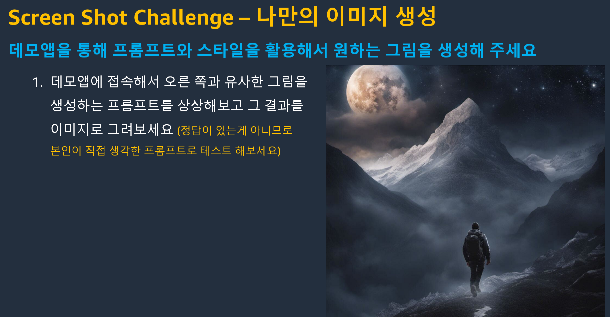

# 실습 1. 이미지 생성 
## 실습 소개
**최종 결과물:**

이 실습에서는 Stable Diffusion, Bedrock, Streamlit을 사용해 기본적인 이미지 생성기를 만들 것 입니다. LangChain은 주로 텍스트 생성 모델을 지원하므로, Boto3 라이브러리를 사용하여 Stable Diffusion과 상호작용 할 것 입니다.
Stable Diffusion은 텍스트 프롬프트에서 이미지를 생성합니다. 무작위 노이즈로 시작하여 일련의 단계에 걸쳐 점차적으로 이미지를 형성합니다. 또한 프롬프트를 기반으로 기존 이미지를 변환하는 데에도 사용할 수 있으며, 이는 이후 실습에서 다루겠습니다.

아래 코드 스니펫을 복사하여 지정된 Python 파일에 붙여넣어 애플리케이션 코드를 빌드할 수 있습니다.

**이 실습을 실행하려면 aws account가 Stable Diffusion을 구독하고 있어야 합니다. Bedrock 콘솔을 통해 구독할 수 있습니다.**

## 사용 사례
- 이미지 생성 패턴은 다음과 같은 사용 사례에 적합합니다:
  - 웹사이트, 이메일 등을 위한 사용자 지정 이미지 생성.
  - 다양한 미디어 형식의 컨셉 아트 제작
  
  

## Bedrock Console Playground를 통한 테스트
다음의 몇 가지 프롬프트를 하나씩 사용해 보고 결과를 확인합니다.(이미지 생성은 텍스트 생성보다 시간이 걸리므로 조금만 기다려 주셔요!!)
> A cat and a person, in the style of Picasso

> a beautiful mountain landscape

> A little (girl) with long blond hair, ((her dad)), and a little dog, the girl looks like (Emma Watson), and her dad looks like (Leonardo DiCaprio), like a (photograph), [[digital]]

> 곤충에 포커스를 가진
photorealistic image taken with a Nikon D850, 105mm macro lens, a vibrant and intricate butterfly resting on a flower

> 눈덮인 산 정상: 
photorealistic image taken with a Fujifilm GFX100, 24mm lens, a breathtaking panoramic view from the summit of a snow-covered mountain

> 산호초와 바닷속:
photorealistic image taken with a Fujifilm GFX 50S, 24mm lens, a vibrant coral reef teeming with marine life beneath the clear, turquoise waters

> 산위 호수:
photorealistic image taken with a Canon 5D Mark III, 24mm lens, a serene mountain lake surrounded by rugged cliffs, reflecting the vivid colors of the surrounding wilderness

> 마녀:
a beautiful and powerful mysterious sorceress, smile, sitting on a rock, lightning magic, hat, detailed leather clothing with gemstones, dress, castle background

- 추가적인 프롬프트를 창의적으로 만들어 보세요(영문만 가능합니다.)
  

    

## Cloud9이나 EC2로 Bedrock API를 이용해서 데모와 같은 python client를 구성해보고 싶으신 경우 아래 내용을 참조하셔요

[1] [Amazon Bedrock구성](https://catalog.us-east-1.prod.workshops.aws/workshops/10435111-3e2e-48bb-acb4-0b5111d7638e/ko-KR/prerequisites/bedrock-setup)
[2] [AWS Cloud9구성](https://catalog.us-east-1.prod.workshops.aws/workshops/10435111-3e2e-48bb-acb4-0b5111d7638e/ko-KR/prerequisites/cloud9-setup)
[3] [실습환경설정(관련패키지 설치)](https://catalog.us-east-1.prod.workshops.aws/workshops/10435111-3e2e-48bb-acb4-0b5111d7638e/ko-KR/prerequisites/lab-setup)
[4] [데모코드](codes/Lab_1.Image_Generation.md)
[5] [workshop 전체 예제 코드 다운로드](https://ws-assets-prod-iad-r-icn-ced060f0d38bc0b0.s3.ap-northeast-2.amazonaws.com/10435111-3e2e-48bb-acb4-0b5111d7638e/workshop.zip)  

    
## 코드 없이 직접 테스트 할수 있게 demo를 미리 준비하였습니다 (아래 데모를 클릭하세요)
<a href="https://bit.ly/my-bedrock" target="_blank"> **https://bit.ly/my-bedrock** </a>

    
## 도전과제 

