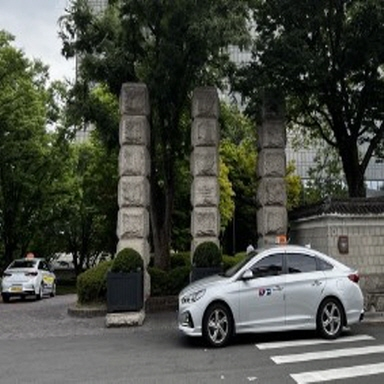

# 실습 3. Advanced Pattern .md)
## (1) 객체를 변경 또는 제거
## 실습소개

Titan Image Generator는 mask prompting을 지원합니다. 이를 통해 정확한 치수를 몰라도 이미지에서 제거할 항목을 지정할 수 있습니다. Titan Image Generator는 지정된 항목을 자동으로 마스킹하여 그 자리에 다른 항목을 삽입할 수 있도록 합니다.
아래 그림을 참조하여 단계를 알아보세요:

|1. 원본 이미지로 시작|2. 마스킹할 객체 지정|3. 마스킹된 영역에 무엇을 칠할지 지정합니다.|4. 원본 이미지의 마스크된 영역에 인페인팅|
|------|---|---|---|
| |"Toy house"|"Log cabin"||

    
## 사용 사례
객체 변경 또는 제거 패턴은 다음과 같은 사용 사례에 적합합니다:
- 차량 사진에서 사람 제거하기
- 집 사진에서 잡동사니 제거하기
- 가구나 장식품을 비슷한 크기의 아이템으로 교체하기

    
## Demo > Lab_3_Advanced_Pattern 메뉴를 선택합니다.
<a href="[https://bit.ly/bedrock-image](https://bit.ly/bedrock-image)" target="_blank"> **https://bit.ly/bedrock-image** </a>

**1. Generate 버튼을 클릭하여 미리 로드된 이미지에서 커튼 부분을 교체합니다.**

**2. 이번에는 미리 로드된 이미지에서 항목을 제거해 보세요.**
- 항목을 제거하려면, **Object to add (제거하려면 비워 둡니다)**라고 표시된 필드에서 텍스트를 삭제 합니다.
- lamp 혹은 table 을 제거해 보세요.

**3. 선택 사항으로 256x256에서 1024x1024 사이의 크기와 인치당 72픽셀의 해상도를 가진 이미지를 업로드합니다.**

**4. 대체할 개체와 대체할 내용을 설정해야 합니다. Generate 버튼을 클릭하여 결과를 확인합니다.**

**5. [응용]아래 이미지를 다운로드 후 업로드 한후, 자동차를 바꿔보세요**  
  
* 예시 : car ---> black benz S650

  
## (2) 이미지 생성 모델의 다양한 활용
- [이미지검색](https://catalog.us-east-1.prod.workshops.aws/workshops/10435111-3e2e-48bb-acb4-0b5111d7638e/ko-KR/image-labs/bedrock-image-search)
- [아웃페인팅](https://catalog.us-east-1.prod.workshops.aws/workshops/10435111-3e2e-48bb-acb4-0b5111d7638e/ko-KR/image-labs/bedrock-image-extension)
- [이미지이해](https://catalog.us-east-1.prod.workshops.aws/workshops/10435111-3e2e-48bb-acb4-0b5111d7638e/ko-KR/image-labs/bedrock-image-understanding)
- [멀티모달 챗봇](https://catalog.us-east-1.prod.workshops.aws/workshops/10435111-3e2e-48bb-acb4-0b5111d7638e/ko-KR/image-labs/bedrock-multimodal-chatbot)

  
## (3) 이미지 스타일
## Demo > Lab_3_Style_Change 메뉴를 선택 하고 다양한 스타일을 적용해 보세요
<a href="http://54.205.45.29:8501" target="_blank"> **https://bit.ly/my-bedrock** </a>

다음의 프롬프트를 작성하고 style을 적용해보세요.
- daguerreotype of robot and cowboy standing side-by-side, directly facing the camera, steampunk, western town in the background, long shot, sepia tone
- photograph of a calico cat, cyberpunk, futuristic cityscape in the background, low angle, long shot, neon sign on building "CALICO CORP", Epic, photorealistic, 4K

  
## 도전과제 

  
## 코드예제 : [codes/Lab_3.Advanced_Pattern.md](codes/Lab_3.Advanced_Pattern.md)

   
.md)

