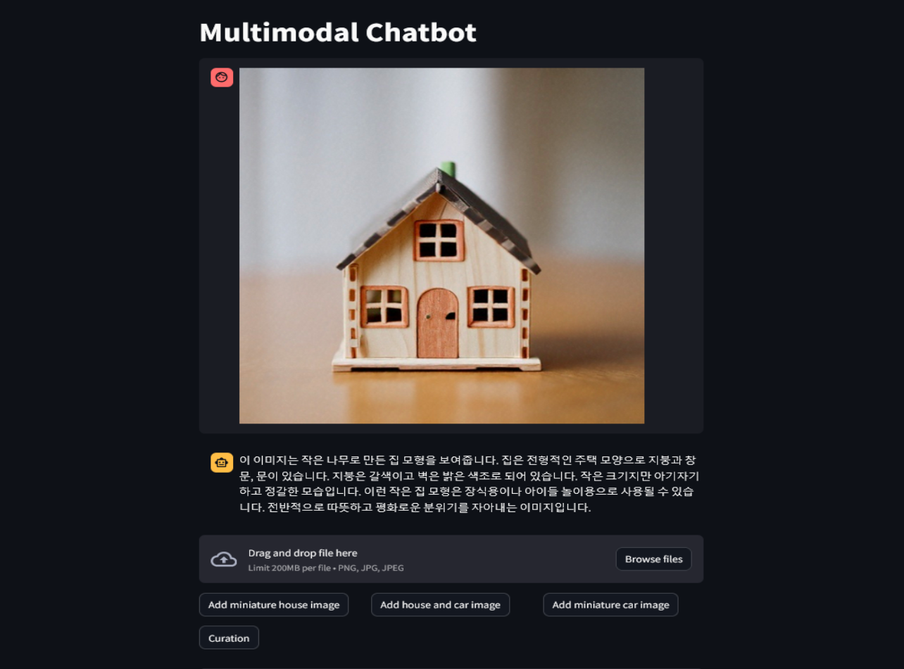
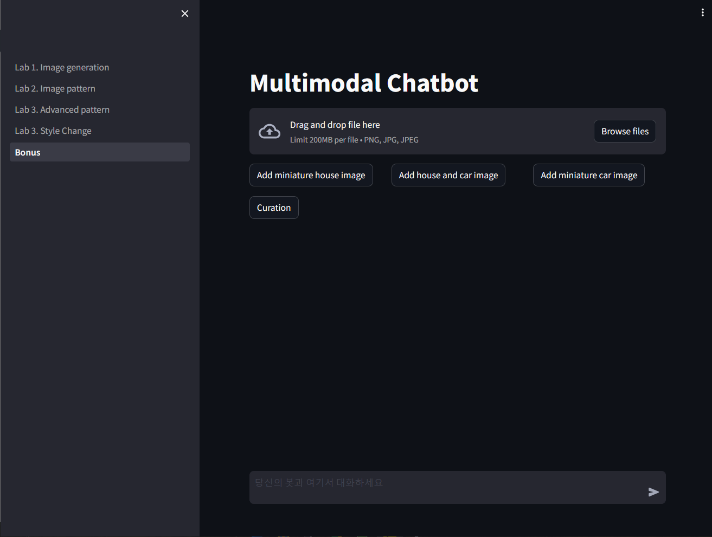
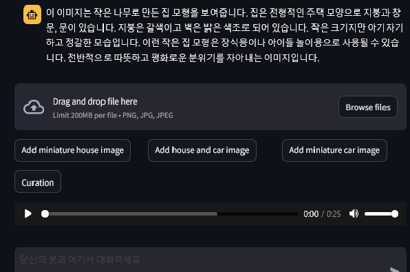

# 실습 4. Multimodal (Bonus) Pattern
## 이미지와 텍스트가 혼합된 다양한 입력을 처리하기
## 1단계

이 실습에서는 Amazon Bedrock, Anthropic Claude 3, and Streamlit으로 멀티모달 챗봇을 구축해 보겠습니다.
멀티모달 챗봇은 텍스트, 이미지 및 기타 형식을 이해할 수 있는 챗봇입니다. 이 예제에서는 텍스트와 이미지만 사용하겠습니다. 

미리 생성된 이미지를 업로드하거나 추가한 다음 Claude 3 모델과 대화할 수 있습니다.
LLM에는 상태나 메모리 개념이 없습니다. 모든 채팅 기록은 외부에서 추적한 다음 새 메시지가 있을 때마다 모델에 전달해야 합니다. 저희는 사용자 지정 개체 목록을 사용하여 채팅 기록을 추적하고 있습니다. 
모델에서 처리할 수 있는 콘텐츠의 양에는 제한이 있으므로 사용자의 메시지와 모델의 응답을 처리할 수 있는 충분한 공간이 남도록 채팅 기록을 잘라내야 합니다. 이 코드는 오래된 메시지를 삭제합니다.

이 예제에서는 LangChain을 사용하지 않고 Boto3를 사용하여 직접 챗봇을 구축합니다. LangChain을 사용하여 구축한 챗봇의 예는 [Basic Chatbot](https://catalog.us-east-1.prod.workshops.aws/workshops/10435111-3e2e-48bb-acb4-0b5111d7638e/ko-KR/image-labs/bedrock-image-search) 또는 [RAG Chatbot](https://catalog.us-east-1.prod.workshops.aws/workshops/10435111-3e2e-48bb-acb4-0b5111d7638e/ko-KR/image-labs/bedrock-image-search)랩에서 확인하실 수 있습니다. 여기서는 [Anthropic Claude Messages API](https://catalog.us-east-1.prod.workshops.aws/workshops/10435111-3e2e-48bb-acb4-0b5111d7638e/ko-KR/image-labs/bedrock-image-search)를 사용하겠습니다.

    
## 2단계 : Demo > Bonus 메뉴를 선택합니다.
데모화면에 접속하면 아래와 같은 웹페이지가 표시됩니다

    
## 3단계 : 결과를 확인해보고 여러가지 테스트를 해보세요
몇 가지 이미지와 프롬프트를 사용해 보고 결과를 확인해 보세요. 이미지 추가 버튼을 사용하여 미리 정의된 이미지를 대화에 가져오거나 직접 이미지를 업로드할 수 있습니다
(가로 및 세로 각각 200~1000픽셀, 이미지당 최대 5MB, 최대 20개)
• 두 이미지를 비교하세요.:  
  • 어느 쪽이 더 큰가요?  
  • 어느 쪽이 더 재미있어 보이나요?  
  • 차는 어떤 색인가요?  

    
## 4단계 : 텍스트와 이미지 프롬프트를 기반으로 Curation(설명)이 생성되었다면 이제 음성으로 만들어보세요

Curation을 만들어서 그림을 설명해주는 음성을 생성해줍니다.
그리고 나서 음성파일을 들어 보세요
(인공지능으로 생성된 음성이 마음에 드시나요? 영어가 아직까진 조금더 자연스러운거 같습니다.)
 (* 음성 생성에는 AWS의 TTS(Text-To-Speech) 서비스인 Amazon Polly 서비스를 활용하였습니다. )

