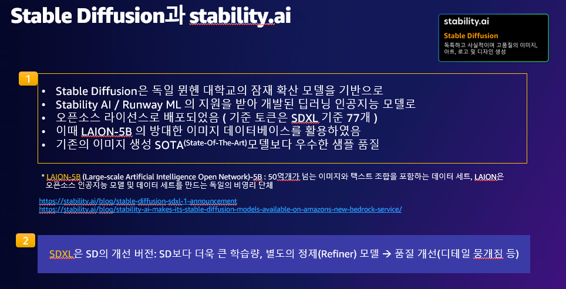

# 이미지 생성

오늘 이미지 생성 HoL은 Amazon Bedrock 콘솔을 통해 어떤 프롬프트와 추론 파라미터, 그리고 모델을 사용할수 있는지를 먼저 배워보고,
실제로 API 방식의 코드 데모를 사용하여 향후에 다양한 형태로 활용될수 있도록 사용자 경험을 드리는 것을 오늘의 목표로 하고 있습니다.

    
# 이미지 생성 ( Image Generation )
## 1. 개요

컴퓨터를 이용해서 이미지를 만드는 작업은 아티스트, 디자이너 및 콘텐츠 제작자에게 지루한 작업이 될 수 있습니다. 하지만 현대에 있어서는 생성형 AI와 FM(Foundation Models) 의 도움으로 이 작업은 예술가의 생각을 표현하는 단 한 줄의 텍스트로 간소화될 수 있습니다. FM은 언어 프롬프트를 사용하여 다양한 주제, 환경 및 장면에 대한 사실적이고 예술적인 이미지를 만드는 데 사용될 수 있습니다. 

이 실습에서는 Amazon Bedrock에서 사용할 수 있는 기반 모델을 사용하여 이미지를 생성하고 기존 이미지를 수정하는 방법을 살펴보겠습니다.

    
## 2. 이미지 프롬프팅 (Image prompting)

좋은 프롬프트를 작성하는 것은 때로는 예술이 될 수 있습니다. 특정 프롬프트가 주어진 모델에 대해 만족스러운 이미지를 생성할지 여부를 예측하는 것은 종종 어렵습니다. 그러나 작동하는 것으로 관찰된 특정 템플릿이 있습니다. 
대체로 이미지 생성에 사용되는 프롬프트는 
1. 이미지 유형 (photograph/sketch/painting etc.)
2. 설명 (subject/object/environment/scene etc.) 
3. 스타일의  (realistic/artistic/type of art etc.)

세 부분으로 크게 나눌 수 있습니다 . 세 부분을 각각 개별적으로 변경하여 이미지 변형을 생성할 수 있습니다. 형용사는 이미지 생성 과정에서 중요한 역할을 하는 것으로 알려져 있습니다. 또한 더 많은 세부 정보를 추가하면 생성 과정에 도움이 됩니다. 

동일한 프롬프트가 여러 번 제공되더라도 모델은 자유도에 따라 다른 이미지를 생성합니다. 따라서 여러 이미지를 생성하고 애플리케이션에 가장 적합한 이미지를 선택할 수 있습니다.

    
## 3. 파운데이션 모델 (Foundation Model)

Amazon Bedrock은 Stability AI의 이미지 생성을 위한 독점 기반 모델인 [Stable Diffusion XL](https://stability.ai/stablediffusion)을 지원합니다. Stable Diffusion은 확산 원리에 따른 디퓨전 모델을 사용하고 있으며 각각 다른 목적을 가진 여러 모델로 구성됩니다. Computer Vison 분야의 이미지생성형 LLM으로는 상업용으로 서비스 되는 미드저니, 오픈소스로 공개된 SDXL, 그리고 OpenAI의 DALL.E 3, 구글의 제미나이가 주로 사용되고 있습니다.

**금일은 다양한 분야의 직원분들이 참석하고 계시기 때문에 개별 모델에 대한 세부 설명은 드리지 않고 있습니다.**

Stable Diffusion의 이미지는 아래 3가지 주요 모델에 의해 생성됩니다.
1. CLIP 텍스트 인코더 (입력 텍스트의 토큰 임베딩 변환)
2. UNet (Diffusion 스텝)
    - 토큰 임베딩과 노이즈 이미지를 입력 받아서, 노이즈 제거 과정을 통해 이미지 텐서 생성
3. VAE 디코더 (이미지 텐서로 실제 이미지 생성)

작동 방식은 다음 아키텍처로 설명할 수 있습니다:

    
## ** 이미지 생성 모델에는 Stability.ai의 SDXL 이외에도 Amazon Titan Image Generator를 사용해볼수도 있습니다.

    
## 4. 패턴
이 워크숍에서는 Amazon Bedrock을 사용하여 이미지 생성에 대한 다음 패턴을 배울 수 있습니다.

**1. Text to Image**
    

    
**2. Image to Image (In-paiting)**
    

    
## 5. Amazom Bedrock, LangChain 그리고 Streamlit의 개요
[Amazon Bedrock](https://aws.amazon.com/ko/bedrock/) 은 파운데이션 모델을 사용하기 위한 완전 관리형 서비스입니다. 이를 통해 텍스트 생성 및 이미지 생성을 위한 단일 API 세트를 사용하여 Amazon 및 타사의 모델에 액세스할 수 있습니다.

이 워크샵에서는 LangChain을 사용하여 Amazon Bedrock으로 생성형 AI 프로토타입을 구축합니다. 초급부터 중급까지 다양한 기술 수준을 목표로 하는 일련의 실습을 진행합니다. 라이브러리와 모델의 기능을 사용하여 다양한 사용 사례를 위한 프로토타입을 구축하는 방법을 배웁니다.

[LangChain](https://python.langchain.com/v0.2/docs/introduction/) 은 Amazon Bedrock의 모델 및 벡터 데이터베이스와 같은 관련 서비스와 상호 작용할 수 있는 편리한 기능을 제공합니다. LangChain은 파이썬과 자바스크립트 라이브러리를 제공합니다. 이 워크샵에서는 파이썬 버전의 LangChain을 사용합니다.

[Streamlit](https://streamlit.io/) 을 사용하면 프론트엔드 개발 기술 없이도 파이썬 코드의 웹 프론트엔드를 빠르게 만들 수 있습니다. Streamlit은 기술자와 비기술자 모두에게 보여줄 수 있는 개념 증명(PoC)을 만드는 데 유용합니다.

**데모 생성에 필요한 오픈소스 및 코드에 대한 세부적인 설명은 금일은 드리지는 않습니다**

