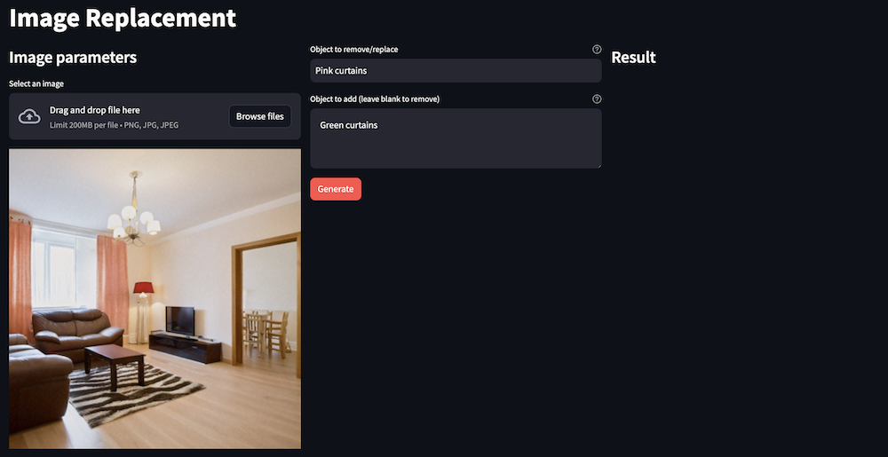

    
## 라이브러리 스크립트 만들기
먼저 Streamlit 프론트엔드와 Bedrock 백엔드를 연결하기 위한 지원 라이브러리를 생성합니다.

**1. AWS Cloud9에서 workshop/labs/image_replacement 폴더로 이동하여 image_replacement_lib_kr.py 파일을 엽니다.**

**2. 이미지 생성을 위한 라이브러리 코드를 구성합니다.**
~~~python
import os
import boto3
import json
import base64
from io import BytesIO
from random import randint

#파일 바이트에서 BytesIO 객체 가져오기
def get_bytesio_from_bytes(image_bytes):
    image_io = BytesIO(image_bytes)
    return image_io

#파일 바이트에서 base64로 인코딩된 문자열 가져오기
def get_base64_from_bytes(image_bytes):
    resized_io = get_bytesio_from_bytes(image_bytes)
    img_str = base64.b64encode(resized_io.getvalue()).decode("utf-8")
    return img_str

#디스크의 파일에서 바이트 로드
def get_bytes_from_file(file_path):
    with open(file_path, "rb") as image_file:
        file_bytes = image_file.read()
    return file_bytes

#InvokeModel API 호출에 대한 문자열화된 리퀘스트 바디를 가져옵니다.
def get_titan_image_inpainting_request_body(prompt, image_bytes=None, mask_prompt=None, negative_prompt=None):
    input_image_base64 = get_base64_from_bytes(image_bytes)
    
    body = { #InvokeModel API에 전달할 JSON 페이로드를 생성합니다.
        "taskType": "INPAINTING",
        "inPaintingParams": {
            "image": input_image_base64,
            "maskPrompt": mask_prompt,
        },
        "imageGenerationConfig": {
            "numberOfImages": 1,  # 생성할 변형 개수
            "quality": "premium",  # 허용되는 값은 " standard" 또는 "premium"입니다.
            "height": 512,
            "width": 512,
            "cfgScale": 8.0,
            "seed": randint(0, 100000),  # 랜덤 시드 사용
        },
    }
    
    if prompt:  #마스킹된 항목이 있던 위치에 삽입할 항목을 표시합니다(항목을 제거하려면 비워둡니다).
        body['inPaintingParams']['text'] = prompt #프롬프트가 없는 경우 마스크 프롬프트에 표시된 항목만 제거합니다.
    
    return json.dumps(body)

#Titan Image Generator 응답에서 BytesIO 객체를 가져옵니다.
def get_titan_response_image(response):

    response = json.loads(response.get('body').read())
    
    images = response.get('images')
    
    image_data = base64.b64decode(images[0])

    return BytesIO(image_data)

#Amazon Titan Image Generator를 사용하여 이미지 생성
def get_image_from_model(prompt_content, image_bytes, mask_prompt=None):
    session = boto3.Session(
        profile_name=os.environ.get("BWB_PROFILE_NAME")
    ) #AWS 자격 증명에 사용할 프로필 이름 설정
    
    bedrock = session.client(
        service_name='bedrock-runtime', #Bedrock 클라이언트를 생성
        region_name=os.environ.get("BWB_REGION_NAME"),
        endpoint_url=os.environ.get("BWB_ENDPOINT_URL")
    ) 
    
    body = get_titan_image_inpainting_request_body(prompt_content, image_bytes, mask_prompt=mask_prompt)
    
    response = bedrock.invoke_model(body=body, modelId="amazon.titan-image-generator-v1", contentType="application/json", accept="application/json")
    
    output = get_titan_response_image(response)
    
    return output
~~~

**3. streamlit app을 만듭니다.**
~~~python
import streamlit as st
import image_replacement_lib_kr as glib

st.set_page_config(layout="wide", page_title="Image Replacement")

st.title("Image Replacement")

col1, col2, col3 = st.columns(3)

with col1:
    st.subheader("Image parameters")
    
    uploaded_file = st.file_uploader("Select an image", type=['png', 'jpg'])
    
    if uploaded_file:
        uploaded_image_preview = glib.get_bytesio_from_bytes(uploaded_file.getvalue())
        st.image(uploaded_image_preview)
    else:
        st.image("images/example.png")
    
    
with col2:
    mask_prompt = st.text_input("Object to remove/replace", value="Pink curtains", help="The mask text")
    
    prompt_text = st.text_area("Object to add (leave blank to remove)", value="Green curtains", height=100, help="The prompt text")
    
    generate_button = st.button("Generate", type="primary")
    
    
with col3:
    st.subheader("Result")

    if generate_button:
        with st.spinner("Drawing..."):
            
            if uploaded_file:
                image_bytes = uploaded_file.getvalue()
            else:
                image_bytes = glib.get_bytes_from_file("images/example.png")
            
            generated_image = glib.get_image_from_model(
                prompt_content=prompt_text, 
                image_bytes=image_bytes, 
                mask_prompt=mask_prompt,
            )
        
        st.image(generated_image)
~~~

**4. streamlit app 실행**
~~~
cd ~/environment/workshop/labs/image_replacement
streamlit run image_replacement_app_kr.py --server.port 8501 --server.enableXsrfProtection=false
~~~

