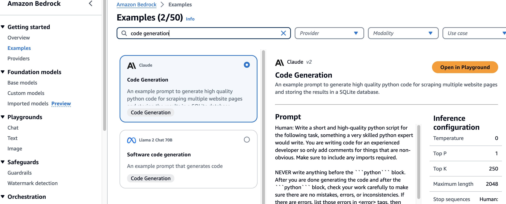
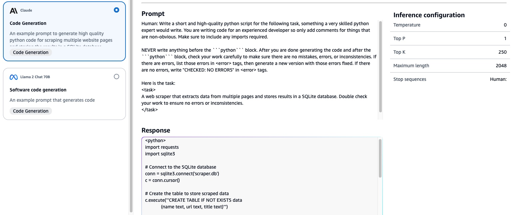
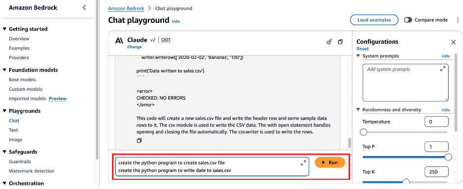
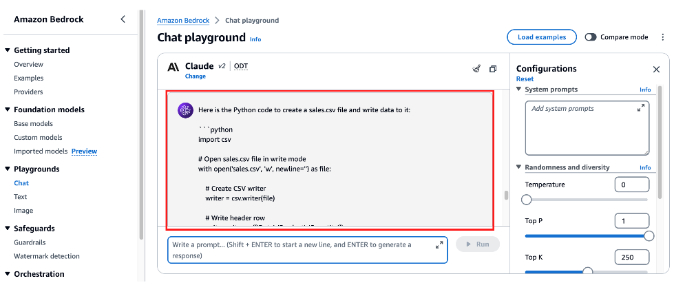
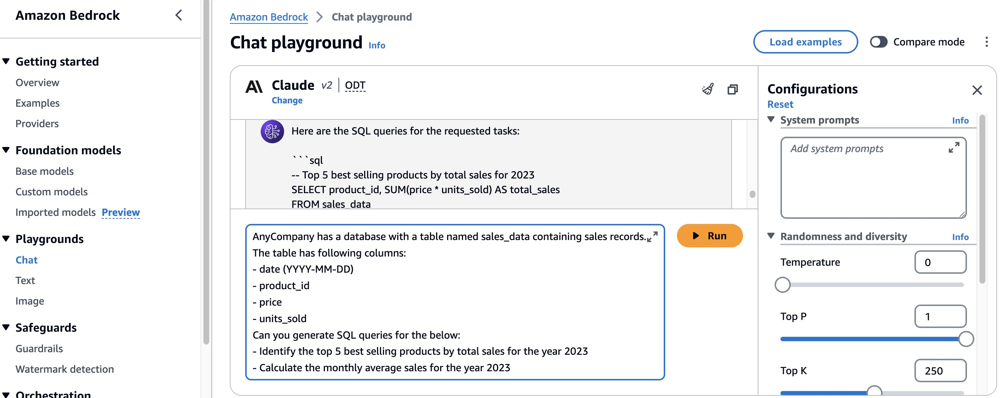
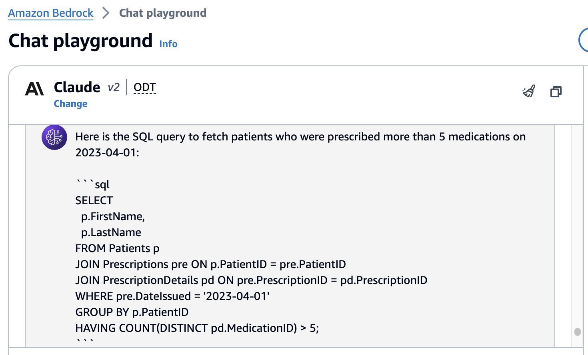

# 실습 1: Bedrock CodeGeneration
## 실습 소개
이 실습에서는 Amazon Bedrock 에서 CodeGeneration을 위한 Claude v2 모델을 활용하여, Code Generation을 실습해봅니다.
 

* 이 실습을 실행하려면 aws account가 Claude v2을 구독하고 있어야 합니다. Bedrock 콘솔을 통해 구독할 수 있습니다.
 
 
 

## Bedrock PlayGround에서 코드 생성 실습하기
#### 1. Amazon Bedrock 콘솔 > Example에서 'Code Generation'을  검색하여, Claude v2를 선택합니다.

Promt와 Response의 예제를 확인하고 내가 찾던 모델인지 확인해봅니다.

실습을 위해 'Open in Playground'를 클릭하여 실습 환경을 생성합니다.
 
 
 

## Text2Python
**1. 다음과 같이 Single-line 코드 생성을 실습해봅니다.**

~~~
create the python program to create sales.csv file
create the python program to write date to sales.csv
~~~

 
Bedrock의 답변을 확인해봅니다.
 

이와 같은 방법으로 여러가지 코드 생성을 테스트 해보겠습니다.
 
 

**2. 다음과 같이 Full function 코드 생성을 실습해봅니다.** 

- 버그가 없을 것, 표준 라이브라리를 쓸 것 등에 대한 요청사항을 추가해봅니다.
~~~
You have a CSV, sales.csv, with columns:
- date (YYYY-MM-DD)
- product_id
- price
- units_sold
Create a python program to analyze the sales data from a CSV file. The program should be able to read the data, and determine below:
- Total revenue for the year
- The product with the highest revenue
- The date with the highest revenue
- Visualize monthly sales using a bar chart
Ensure the code is syntactically correct, bug-free, optimized, not span multiple lines unnessarily, and prefer to use standard libraries. Return only python code without any surrounding text, explanation or context.
~~~
 
 
 

## Text2SQL : 대화로 DB를 검색하기
 
 Code Generation 을 통해 우리는 Python 과 같은 일반 프로그래밍 언어를 작성할 수 있을 뿐만 아니라 SQL 도 생성할 수 있습니다. 한 마디로 우리는 이제 대화로 DataBase를 검색할 수 있게 되었습니다. 이 섹션에서는  SQL Query Generation을 실습해 보겠습니다.

**1.어느 회사의 영업데이터(sales_data)에서, 2023년 Top5 제품을 알려주는 쿼리와, 2023년 평균 월별 영업 통계를 계산해달라고 요청해봅시다.**   
~~~
AnyCompany has a database with a table named sales_data containing sales records. The table has following columns:
- date (YYYY-MM-DD)
- product_id
- price
- units_sold
Can you generate SQL queries for the below: 
- Identify the top 5 best selling products by total sales for the year 2023
- Calculate the monthly average sales for the year 2023
~~~

 
 
 

**2.어느 병원의 환자 관리 시스템의 테이블 스키마를 알려주고, 2023년 4월 1일에 5개 이상의 서로 다른 약을 처방받은 모든 환자를 가져오는 SQL 쿼리를 작성해달라고 해보겠습니다.**

~~~
You're provided with a database schema representing any hospital's patient management system.
The system holds records about patients, their prescriptions, doctors, and the medications prescribed.

Here's the schema:

sql
CREATE TABLE Patients (
    PatientID int,
    FirstName varchar(50),
    LastName varchar(50),
    DateOfBirth datetime,
    Gender varchar(10),
    PRIMARY KEY (PatientID)
);

CREATE TABLE Doctors (
    DoctorID int,
    FirstName varchar(50),
    LastName varchar(50),
    Specialization varchar(50),
    PRIMARY KEY (DoctorID)
);

CREATE TABLE Prescriptions (
    PrescriptionID int,
    PatientID int,
    DoctorID int,
    DateIssued datetime,
    PRIMARY KEY (PrescriptionID)
);

CREATE TABLE Medications (
    MedicationID int,
    MedicationName varchar(50),
    Dosage varchar(50),
    PRIMARY KEY (MedicationID)
);

CREATE TABLE PrescriptionDetails (
    PrescriptionDetailID int,
    PrescriptionID int,
    MedicationID int,
    Quantity int,
    PRIMARY KEY (PrescriptionDetailID)
);

Write a SQL query that fetches all the patients who were prescribed more than 5 different medications on 2023-04-01.
~~~

Claude가 어떻게 SQL을 작성해 주는지 확인해보겠습니다.  

 
 
 

## 연습 코딩
이번 연습코딩에서는 프롬프트 예시를 드리지 않습니다. 직접 Bedrock Claude에게 코딩을 해달라고 한글로 요청해봅시다.

**1. 검색 포털 naver.com에서  '뉴진스'의 기사를 검색하고 기사 제목과 링크 정보를 출력하는 파이썬 어플리케이션을 만들어달라고 해보세요.**
 
 

**2. 내가 우리 부서의 파트장이라고 가정했을 때, 우리부서에서 연봉 1위가 누구인지와, 그 연봉이 얼마인지를 조회하는 쿼리를 만들어봅시다.**
 
 

**3. 내 고등학교 성적이 수학은 전교 1등이었는데 영어 성적은 1등이 아니었을 때가 몇학년인지 조회하는 쿼리를 만들어달라고 해보세요.**
 
 

**4. 엔비디아의 주가가 떨어질때마다 내게 이메일을 보내주는 프로그램을 개발해달라고 해봅시다.**
