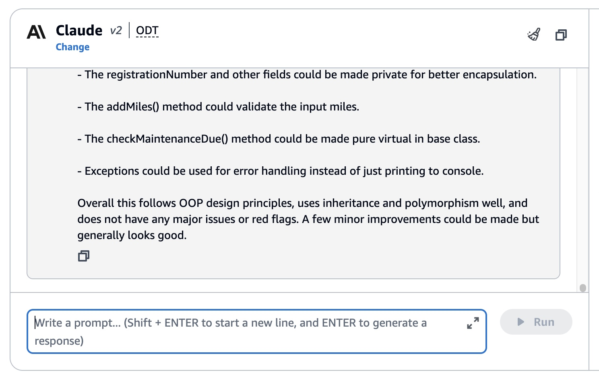
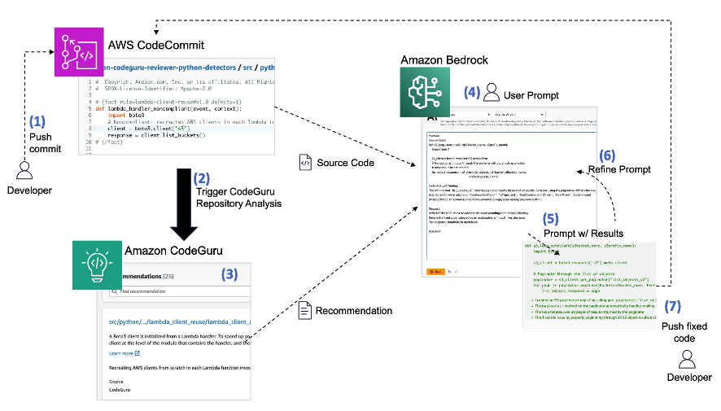

# 실습 2: Bedrock Code Interpretation
## 실습 소개
Code Generation을 이야기 할 때, 우리는 단순히 코드의 생성 뿐 아니라 코드를 이해할 수 있게되었다고 말할 수 있습니다. 개발자에게 프로그래밍이란 단순히 어떤 기능을 만드는데 그치지 않고, Best Practice를 준수하는 코딩을 하는 능력뿐만 아니라 동시에 다른 사람의 코드를 이해하는 능력도 못지않게 중요합니다. CodeLLM 이 가진 Code Intepretation 기능이 강조되는 이유입니다. 
이번 실습에서는 Code Intepretation을 통해, 코드를 해석해 보겠습니다. 
 
**1.이번에는 코드에 대한 해석/설명을 시도해 보겠습니다.
무언가 잘못되어있거나, best practice가 아니면 알려달라고도 추가로 요청해보겠습니다.**   

~~~python
explain below code and highlight if any red flags or not following best practices.

#include <iostream>
#include <string>
#include <vector>

class Vehicle {
protected:
    std::string registrationNumber;
    int milesTraveled;
    int lastMaintenanceMile;

public:
    Vehicle(std::string regNum) : registrationNumber(regNum), milesTraveled(0), lastMaintenanceMile(0) {}

    virtual void addMiles(int miles) {
        milesTraveled += miles;
    }

    virtual void performMaintenance() {
        lastMaintenanceMile = milesTraveled;
        std::cout << "Maintenance performed for vehicle: " << registrationNumber << std::endl;
    }

    virtual void checkMaintenanceDue() {
        if ((milesTraveled - lastMaintenanceMile) > 10000) {
            std::cout << "Vehicle: " << registrationNumber << " needs maintenance!" << std::endl;
        } else {
            std::cout << "No maintenance required for vehicle: " << registrationNumber << std::endl;
        }
    }

    virtual void displayDetails() = 0;

    ~Vehicle() {
        std::cout << "Destructor for Vehicle" << std::endl;
    }
};

class Truck : public Vehicle {
    int capacityInTons;

public:
    Truck(std::string regNum, int capacity) : Vehicle(regNum), capacityInTons(capacity) {}

    void displayDetails() override {
        std::cout << "Truck with Registration Number: " << registrationNumber << ", Capacity: " << capacityInTons << " tons." << std::endl;
    }
};

class Car : public Vehicle {
    std::string model;

public:
    Car(std::string regNum, std::string carModel) : Vehicle(regNum), model(carModel) {}

    void displayDetails() override {
        std::cout << "Car with Registration Number: " << registrationNumber << ", Model: " << model << "." << std::endl;
    }
};

int main() {
    std::vector<Vehicle*> fleet;

    fleet.push_back(new Truck("XYZ1234", 20));
    fleet.push_back(new Car("ABC9876", "Sedan"));

    for (auto vehicle : fleet) {
        vehicle->displayDetails();
        vehicle->addMiles(10500);
        vehicle->checkMaintenanceDue();
        vehicle->performMaintenance();
        vehicle->checkMaintenanceDue();
    }

    for (auto vehicle : fleet) {
        delete vehicle; 
    }

    return 0;
}
~~~

몇 가지 개선포인트가 있지만 전반적으로 코드 디자인이 괜찮다고 알려줍니다.

 
 
 
## 도전 과제 - Bedrock Claude로 코드 취약점을 이해해보자

그동안 배운 내용으로 코드 취약점을 분석해보겠습니다.
Amazon CodeGuru Reviewer를 사용해서 코드의 결점을 식별하여 이를 사용자에게 제공하는 서비스입니다. 내 회사의 보안팀은 Amazon CodeGuru Reviewer를 사용하여, 전사 시스템의 코드 취약점을 주기적으로 점검하고 담당자에게 전달하여, 이에 대한 조치일정 계획을 수립합니다. 우리가 기존 레거시 시스템의 운영자라고 가정해봅시다. 전임자가 작성한 코드를 이해가 안되지만, 코드취약점 대상 서비스에 나의 담당 시스템에서 아래 코드가 SQL Injection에 취약하다고 적발되어 당장 오늘까지 내가 수정을 해야합니다. 하지만 나는 비전공자에 코딩이 처음인 사람입니다. 오늘 수정하지 않으면 집에갈 수 없습니다.

이 코드는 보안팀이 내 시스템의 코드가 SQL Injection에 취약하다고 지적한 코드입니다. 

~~~python
Def execute_query_noncompliant(request):
    import sqlite3
    name = request.GET.get("name")
    query = "SELECT * FROM Users WHERE name = " + name + ";"
    with sqlite3.connect("example.db") as connection:
        cursor = connection.cursor()
        # Noncompliant: user input is used without sanitization.
        cursor.execute(query)
        connection.commit()
        connection.close()
~~~
1) Bedrock을 통해 이 코드의 내용을 해석해보세요.(필수)
 
 

2) 해당 코드가 SQL Injection에 취약한 이유를 확인해 보세요.(필수)
 
 

3-Advanced) 어떻게 코드를 수정해야할지 확인해보세요 (옵션)
