## Text2SQL : 대화로 DB를 검색하기
 
Code Generation 을 통해 우리는 Python 과 같은 일반 프로그래밍 언어를 작성할 수 있을 뿐만 아니라 SQL 도 생성할 수 있습니다. 한 마디로 우리는 이제 대화로 DataBase를 검색할 수 있게 되었습니다. 이 섹션에서는  SQL Query Generation을 실습해 보겠습니다.


## 환경셋팅 

#### 1. 다음 실습은 Calude 3.7 Sonnet 과 Titan Embeddings G1 - Text models를 사용하므로, model access에서 두 모델에 대한 사용 요청을 합니다. 
<!--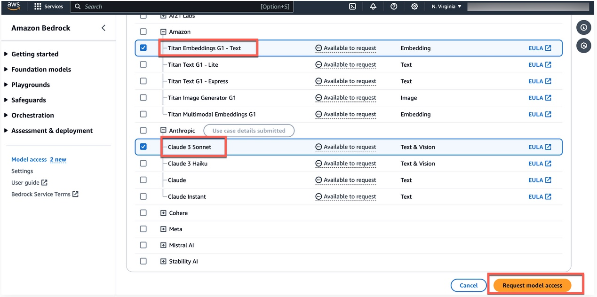-->
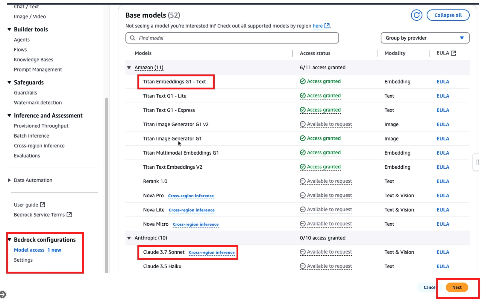


#### 2. SageMaker Console(https://console.aws.amazon.com/sagemaker) 을 열고 Notebook을 하나 생성합니다. 
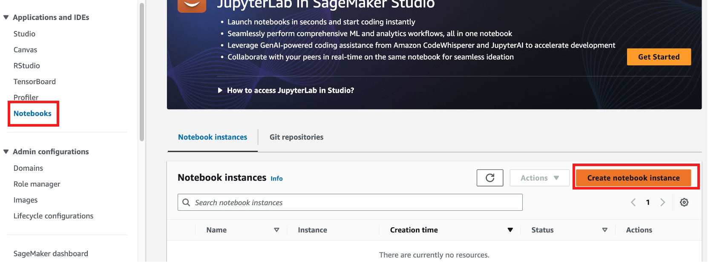

notebook instance name을 설정하고, 알맞은 인스턴스 타입을 선택합니다. (예시에서는 ml.g4dn.xlarge 사용 )
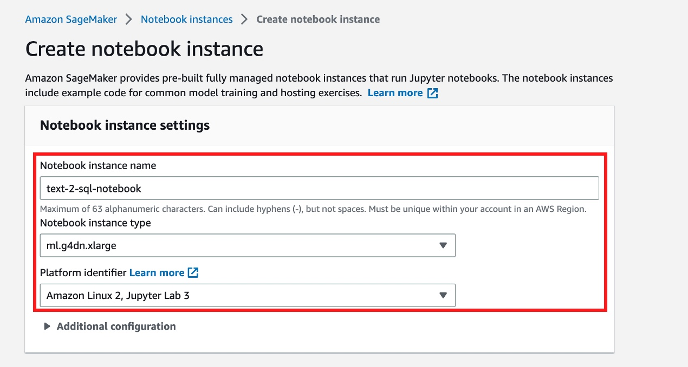

미리 생성되어있는 기본 IAM Role을 선택합니다.
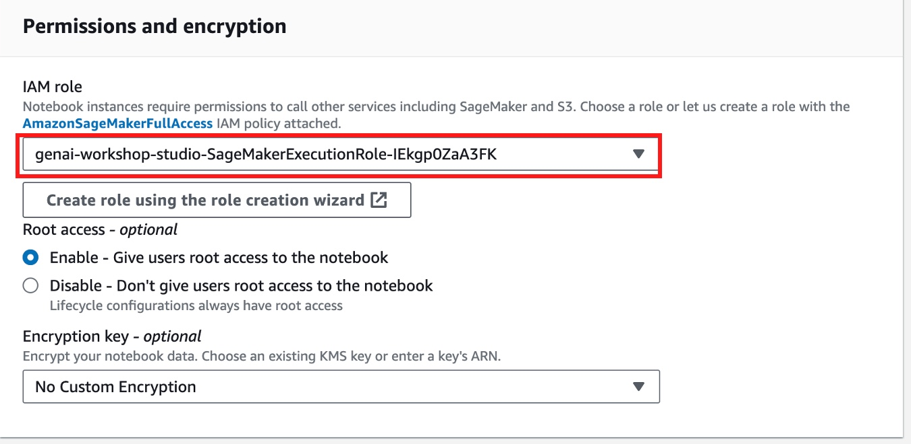

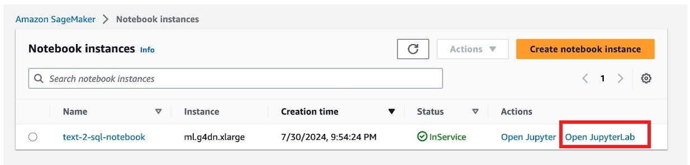


#### 3.IAM Role에서 AmazonAthenaFullAccess, AWSGlueConsoleFullAccess를 추가합니다. 
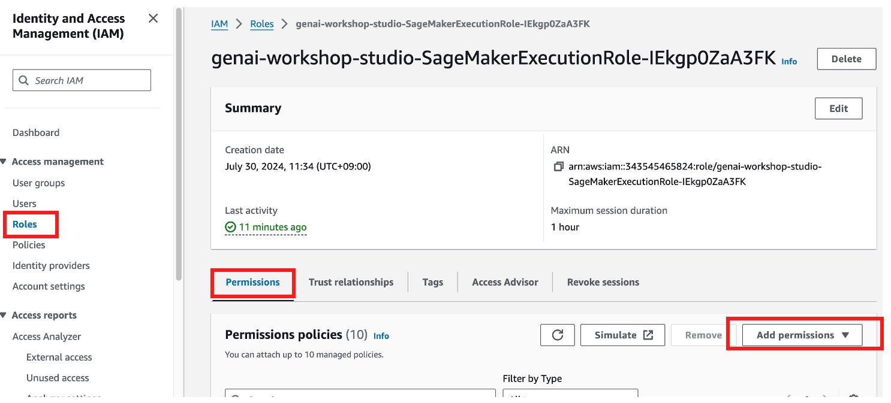
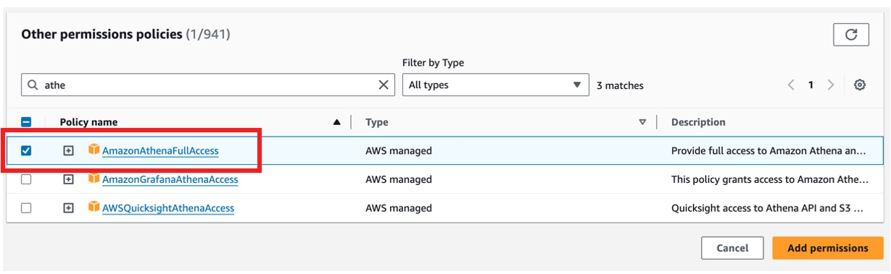
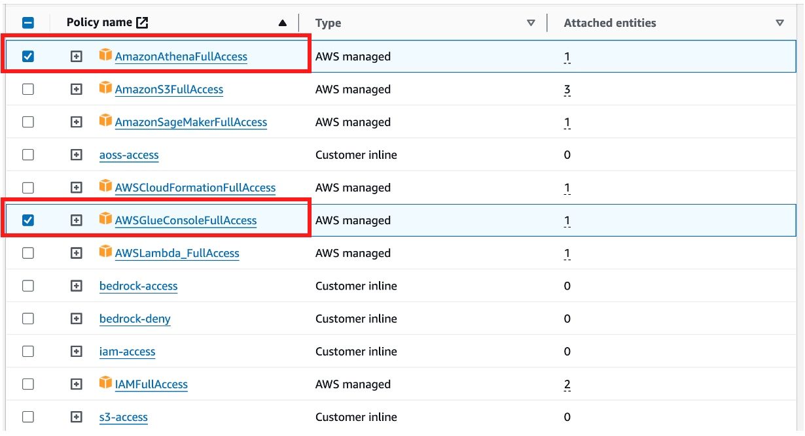


#### 4. Notebook Instance에서 Terminal을 실행시킵니다.  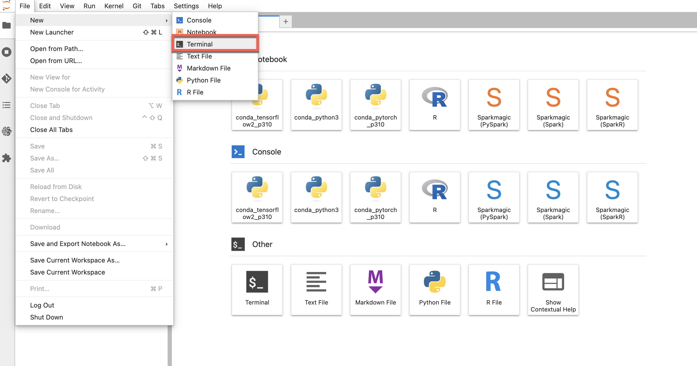

#### 5. 다음 코드를 clone하여 실행시킵니다. 

```
cd SageMaker
```

```
git clone https://github.com/caracalgit/natural-language-querying-of-data-in-s3-with-athena-and-generative-ai-text-to-sql.git
```

#### 6.  kernel로 conda_python3를 선택하여 code>workshop.ipynb 파일을 실행시킵니다.

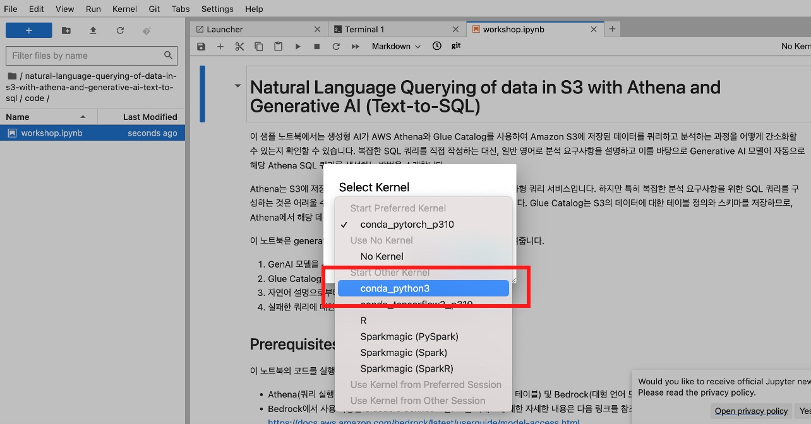


