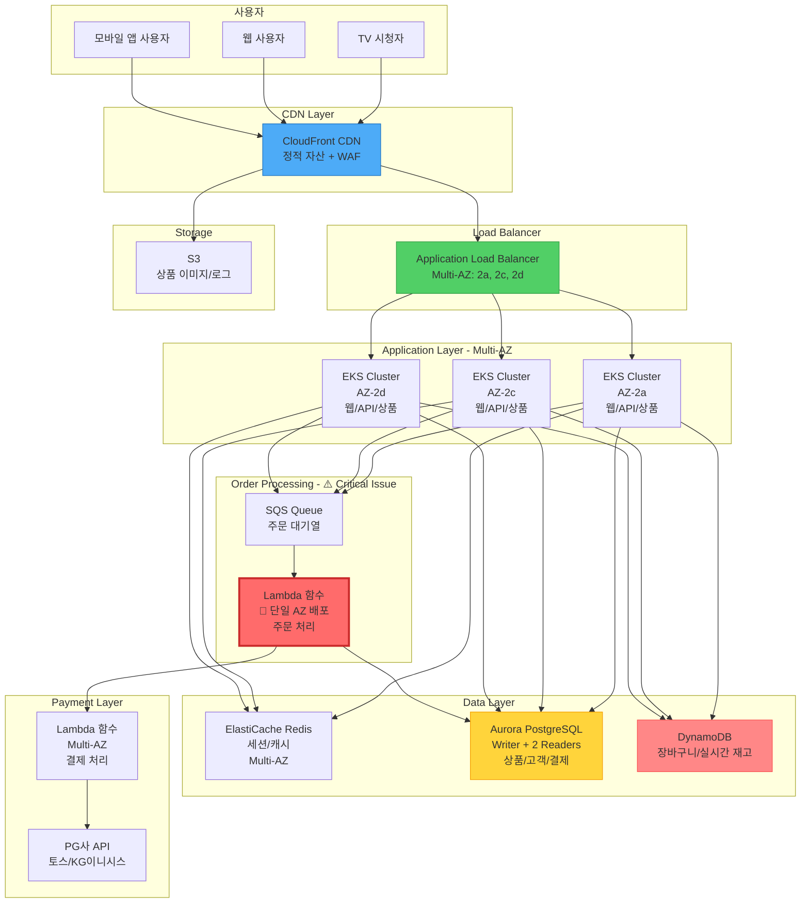
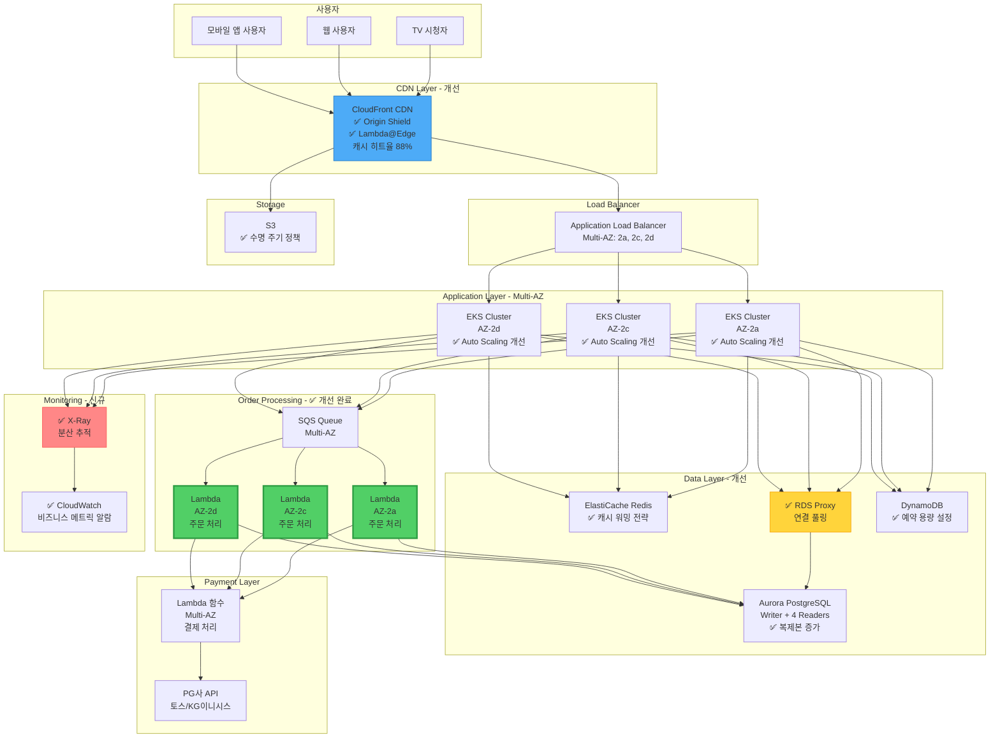
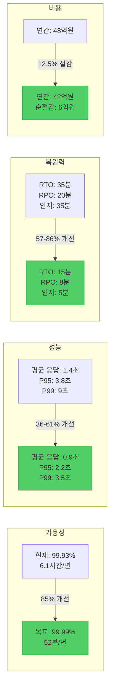
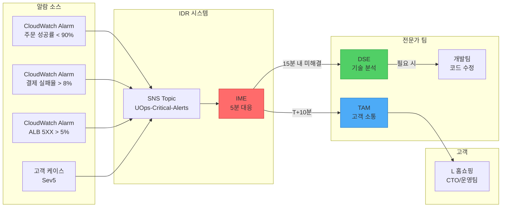

# Critical Workload Review (CWR) 산출물
## L 홈쇼핑 - 통합 커머스 플랫폼

---

### 문서 정보
- **고객명**: L 홈쇼핑
- **워크로드명**: 통합 커머스 플랫폼 (온라인몰 + 모바일앱 + TV홈쇼핑)
- **CWR 수행일**: 2025년 1월 28일
- **담당 DSE**: 김영수 (E-commerce & Retail Specialist)
- **담당 TAM**: 이지현 (Principal TAM)
- **검토 버전**: v1.0
- **다음 검토 예정일**: 2025년 4월 28일 (분기별)

---

## Executive Summary (경영진 요약)

### 워크로드 개요
L 홈쇼핑의 통합 커머스 플랫폼은 연간 4조원 이상의 거래액을 처리하는 미션 크리티컬 시스템입니다. 
TV 홈쇼핑, 온라인몰, 모바일 앱을 통합한 옴니채널 플랫폼으로, 일평균 40만 건의 주문을 처리하며 
특히 라이브 방송 중 트래픽이 평소 대비 15배 이상 급증하는 특성을 가지고 있습니다.

### 비즈니스 영향도
- **가용성 목표**: 99.99% (연간 다운타임 52분 이하)
- **시간당 잠재 손실**: 약 4.5억원 (피크 시간 기준)
- **일평균 거래액**: 약 110억원
- **동시 접속자**: 평상시 4만명, 피크 시 60만명
- **규제 요구사항**: 전자상거래법, 개인정보보호법, PCI-DSS

### 주요 발견사항 요약

#### 🔴 Critical (즉시 조치 필요)
1. **주문 처리 시스템 단일 장애점**: 주문 처리 Lambda가 단일 AZ에 배포되어 있어 AZ 장애 시 전체 주문 불가
2. **재고 관리 DB 복제 지연**: Aurora 읽기 복제본 지연이 피크 시 45초 이상 발생, 재고 부족 판매 위험
3. **알람 누락**: 주문 실패율, 결제 성공률 등 핵심 비즈니스 메트릭 알람 미설정

#### 🟡 High (30일 내 조치 권장)
1. **Auto Scaling 임계값 부적절**: 현재 CPU 75% 기준이나 실제 트래픽 급증 시 대응 지연
2. **CloudFront 캐시 최적화 부족**: 정적 자산 캐시 히트율 62% (목표 90% 이상)
3. **RDS 백업 복구 테스트 미실시**: 최근 9개월간 복구 테스트 기록 없음

#### 🟢 Medium (90일 내 개선 권장)
1. **Lambda 동시 실행 한도**: 현재 사용률 65%, 예약 동시성 미설정
2. **S3 수명 주기 정책 미흡**: 오래된 로그 및 이미지 파일 자동 삭제 정책 부재
3. **비용 최적화 기회**: RI/SP 미활용으로 연간 약 2.5억원 절감 가능

---

## 1. 워크로드 아키텍처 개요

### 1.1 현재 아키텍처 다이어그램

#### Mermaid 다이어그램 (시각화)


### 1.2 주요 AWS 서비스 사용 현황

| 서비스 | 용도 | 현재 구성 | 월 사용량 |
|--------|------|-----------|-----------|
| EKS | 컨테이너 오케스트레이션 | 3 AZ, 40 nodes | 120 vCPU |
| Aurora PostgreSQL | 상품/주문/고객 DB | db.r6g.2xlarge (Writer 1, Reader 2) | 8 vCPU |
| DynamoDB | 장바구니/실시간 재고 | On-Demand, 2 GSI | 400M RCU/WCU |
| ElastiCache Redis | 세션/캐시 | cache.r6g.large (3 nodes) | 9 vCPU |
| Lambda | 주문/결제/알림 | 40개 함수, 평균 512MB | 4M invocations |
| S3 | 상품 이미지/로그 | Standard 40TB, IA 80TB | 120TB |
| CloudFront | CDN | 8 distributions | 400TB 전송 |
| ALB | 로드 밸런싱 | 2 ALB (Multi-AZ) | 80M requests |
| Route 53 | DNS | 4 hosted zones | 40M queries |
| CloudWatch | 모니터링/로깅 | 400 metrics, 1.5TB logs | - |
| SNS/SQS | 메시징 | 8 topics, 15 queues | 80M messages |
| Kinesis | 실시간 데이터 스트림 | 8 shards | 8GB/day |

### 1.3 트래픽 패턴 분석

#### 일반 트래픽 패턴
- **평일 오전 (09:00-12:00)**: 낮은 트래픽 (기준 대비 45%)
- **평일 점심 (12:00-14:00)**: 중간 트래픽 (기준 대비 75%)
- **평일 저녁 (19:00-23:00)**: 높은 트래픽 (기준 대비 160%)
- **주말**: 평일 대비 130% 트래픽

#### 라이브 방송 트래픽 (특별 이벤트)
- **방송 시작 전 (T-30분)**: 트래픽 급증 시작 (2.5배)
- **방송 중 (T+0 ~ T+60분)**: 피크 트래픽 (15배)
- **방송 종료 후 (T+60 ~ T+120분)**: 점진적 감소 (7배 → 3배)

#### 특별 이벤트 (블랙프라이데이, 빅세일 등)
- **이벤트 시작 시점**: 순간 트래픽 25배 급증
- **지속 시간**: 3-5시간
- **주문 집중도**: 전체 주문의 35%가 첫 1시간에 발생

---

## 2. Phase 1: Partnership Initiation (파트너십 시작)

### 2.1 비즈니스 목표 및 우선순위

#### 핵심 비즈니스 목표
1. **매출 성장**: 전년 대비 18% 성장 목표 (4.7조원)
2. **고객 경험 개선**: 페이지 로딩 시간 2.5초 이하 유지
3. **운영 효율성**: 시스템 다운타임 연간 1시간 이하
4. **비용 최적화**: 클라우드 비용 12% 절감

#### 주요 이해관계자
- **CTO (최고기술책임자)**: 전체 기술 전략 및 의사결정
- **IT 운영팀장**: 일상 운영 및 모니터링
- **개발팀장**: 신규 기능 개발 및 배포
- **보안팀장**: 보안 정책 및 컴플라이언스
- **비즈니스 팀장**: 마케팅 이벤트 및 매출 목표

### 2.2 현재 운영 상태

#### 가용성 현황 (최근 6개월)
- **전체 가용성**: 99.93% (목표: 99.99%)
- **주요 장애**: 4건 (각 25분, 18분, 12분, 8분)
  - 2024년 9월: Aurora DB 장애 (25분)
  - 2024년 10월: Lambda 동시 실행 한도 초과 (18분)
  - 2024년 11월: ALB 헬스체크 오류 (12분)
  - 2024년 12월: 주문 처리 Lambda 장애 (8분)

#### 성능 현황
- **평균 응답 시간**: 1.4초 (목표: 1초 이하)
- **P95 응답 시간**: 3.8초 (목표: 3초 이하)
- **P99 응답 시간**: 9초 (목표: 5초 이하)
- **에러율**: 0.08% (목표: 0.01% 이하)

#### 보안 현황
- **WAF 규칙**: 45개 활성화
- **DDoS 공격 차단**: 월평균 85건
- **보안 패치**: 월 1회 정기 적용
- **취약점 스캔**: 주 1회 자동 실행

---

## 3. Phase 2: Technical Discovery (기술 발견)

### 3.1 관찰성 (Observability) 평가

#### 현재 모니터링 구성

##### CloudWatch Metrics (현재 설정)
```
✅ 설정됨:
- EKS CPU/메모리 사용률
- ALB 요청 수 및 응답 시간
- RDS CPU/메모리/연결 수
- DynamoDB 읽기/쓰기 용량
- Lambda 실행 시간 및 에러

⚠️ 누락됨 (Critical):
- 주문 성공률 / 실패율
- 결제 성공률 / 실패율
- 장바구니 이탈률
- 재고 동기화 지연
- 사용자 세션 타임아웃
```

##### 알람 설정 현황
```
현재 알람: 22개
├── 인프라 알람: 18개 (CPU, 메모리, 디스크)
├── 애플리케이션 알람: 2개 (에러율, 응답시간)
└── 비즈니스 알람: 2개 (주문 수 급감)

⚠️ 문제점:
1. 비즈니스 메트릭 알람 부족
2. 알람 임계값이 너무 높게 설정 (CPU 85%)
3. 알람 우선순위 미분류 (모두 동일 중요도)
4. 알람 수신자 그룹 미분류 (모두에게 전송)
```

### 3.2 복원력 (Resilience) 평가

#### Multi-AZ 배포 현황
```
✅ Multi-AZ 구성:
- ALB: 3 AZ (2a, 2c, 2d)
- EKS: 3 AZ
- Aurora: Writer 1 AZ, Reader 2 AZ
- ElastiCache: 3 nodes (Multi-AZ)

⚠️ 단일 AZ 위험:
- 주문 처리 Lambda: 단일 AZ 배포 (Critical!)
- 일부 배치 작업: 단일 AZ
```

#### 장애 복구 능력

##### RTO/RPO 목표 vs 현실
| 시스템 | RTO 목표 | 현재 RTO | RPO 목표 | 현재 RPO | 상태 |
|--------|----------|----------|----------|----------|------|
| 웹/앱 서버 | 5분 | 12분 | 0 | 0 | ⚠️ 개선 필요 |
| 주문 DB | 15분 | 35분 | 5분 | 20분 | ⚠️ 개선 필요 |
| 주문 처리 시스템 | 5분 | 미측정 | 0 | 미측정 | 🔴 Critical |
| 재고 시스템 | 10분 | 18분 | 1분 | 8분 | ⚠️ 개선 필요 |

---

## 4. Phase 3: Recommendations (권장사항)

### 4.1 Critical (즉시 조치 필요 - 2주 이내)

#### 🔴 권장사항 #1: 주문 처리 시스템 Multi-AZ 배포
**문제점**: 주문 처리 Lambda가 단일 AZ에 배포되어 AZ 장애 시 전체 주문 불가

**비즈니스 영향**:
- AZ 장애 시 시간당 4.5억원 손실
- 고객 신뢰도 하락
- 규제 위반 가능성

**권장 솔루션**:
```
현재 아키텍처:
SQS → Lambda (ap-northeast-2a only) → Aurora

권장 아키텍처:
SQS (Multi-AZ)
  ↓
Lambda (ap-northeast-2a, 2c, 2d)
  ↓
Aurora (Multi-AZ)

구현 단계:
1. Lambda 함수를 Multi-AZ VPC 서브넷에 배포
2. SQS 큐 Multi-AZ 구성 확인
3. 장애 시나리오 테스트
4. 모니터링 및 알람 설정
```

**예상 효과**:
- AZ 장애 시에도 주문 서비스 지속
- RTO: 미측정 → 5분
- 가용성: 99.9% → 99.99%

**구현 난이도**: 중간 (2주)
**비용 영향**: 월 +400만원 (Lambda 증가)
**담당**: DSE (주도), 개발팀 (협력)

---

#### 🔴 권장사항 #2: 핵심 비즈니스 메트릭 알람 추가
**문제점**: 주문 실패율, 결제 성공률 등 비즈니스 메트릭 알람 미설정

**비즈니스 영향**:
- 문제 발생 인지 지연 (평균 35분)
- 고객 이탈 및 매출 손실
- 근본 원인 분석 어려움

**권장 알람 목록**:
```
1. 주문 성공률 알람
   - 메트릭: 주문 성공 / 전체 주문 시도
   - 임계값: 95% 이하 (Warning), 90% 이하 (Critical)
   - 평가 기간: 5분
   - 조치: IME 즉시 대응

2. 결제 성공률 알람
   - 메트릭: 결제 성공 / 전체 결제 시도
   - 임계값: 96% 이하 (Warning), 92% 이하 (Critical)
   - 평가 기간: 5분
   - 조치: IME 즉시 대응

3. 장바구니 이탈률 알람
   - 메트릭: 장바구니 추가 후 미결제
   - 임계값: 75% 이상 (평소 65%)
   - 평가 기간: 10분
   - 조치: 사용자 경험 점검

4. 재고 동기화 지연 알람
   - 메트릭: 재고 업데이트 지연 시간
   - 임계값: 15초 이상
   - 평가 기간: 5분
   - 조치: 재고 시스템 점검

5. API 응답 시간 알람 (P95)
   - 메트릭: P95 응답 시간
   - 임계값: 4초 이상
   - 평가 기간: 5분
   - 조치: 성능 분석
```

**예상 효과**:
- 문제 인지 시간: 35분 → 5분
- IDR 5분 대응 가능
- 근본 원인 분석 시간 단축

**구현 난이도**: 낮음 (1주)
**비용 영향**: 월 +40만원 (CloudWatch 메트릭)
**담당**: DSE (설계), 개발팀 (구현)

---

#### 🔴 권장사항 #3: Aurora 읽기 복제 지연 해결
**문제점**: 피크 시 읽기 복제본 지연 45초 이상, 재고 부족 판매 위험

**비즈니스 영향**:
- 재고 없는 상품 판매 → 고객 불만
- 주문 취소율 증가
- 고객 서비스 비용 증가

**권장 솔루션**:
```
1. RDS Proxy 도입 (즉시)
   - 연결 풀링으로 DB 부하 감소
   - 장애 조치 시간 단축
   - 예상 효과: 연결 수 45% 감소

2. 읽기 복제본 추가 (1주)
   - 2개 → 4개로 증가
   - 읽기 부하 분산
   - 예상 효과: 복제 지연 45초 → 8초

3. 쿼리 최적화 (2주)
   - 느린 쿼리 식별 (Performance Insights)
   - 인덱스 추가
   - 쿼리 리팩토링
   - 예상 효과: 쿼리 시간 45% 단축
```

**예상 효과**:
- 복제 지연: 45초 → 8초
- 재고 정확도: 93% → 99%
- 주문 취소율: 6% → 1.5%

**구현 난이도**: 중간-높음 (3주)
**비용 영향**: 월 +2.5천만원 (RDS Proxy + 복제본)
**담당**: DSE (설계), DBA (구현)

---

### 4.2 High Priority (30일 내 조치 권장)

#### 🟡 권장사항 #4: Auto Scaling 정책 최적화
**문제점**: CPU 75% 기준으로 트래픽 급증 시 대응 지연

**권장 개선사항**:
```
1. Target Tracking 임계값 조정
   현재: CPU 75%
   권장: CPU 55% 또는 ALB RequestCountPerTarget

2. Step Scaling 추가
   트래픽 급증 시 빠른 확장
   - CPU 65%: +3 nodes
   - CPU 75%: +6 nodes
   - CPU 85%: +12 nodes

3. Scheduled Scaling 추가
   정기 이벤트 대응
   - 라이브 방송 30분 전: +15 nodes
   - 점심 시간 (11:30): +8 nodes
   - 저녁 시간 (18:30): +12 nodes
```

**예상 효과**:
- 확장 대응 시간: 12분 → 4분
- 피크 시 응답 시간 개선: 9초 → 3.5초
- 고객 이탈률 감소: 12% → 4%

**구현 난이도**: 낮음 (1주)
**비용 영향**: 월 +800만원 (평균 인스턴스 증가)
**담당**: DSE (설계), 운영팀 (구현)

---

#### 🟡 권장사항 #5: CloudFront 캐시 최적화
**문제점**: 캐시 히트율 62% (목표 90%)

**권장 개선사항**:
```
1. 캐시 정책 최적화
   정적 자산 (이미지, CSS, JS):
   - TTL: 24시간 → 7일
   - Cache-Control: max-age=604800
   
2. Origin Shield 활성화
   - 서울 리전에 Shield 배치
   - 오리진 부하 28% 감소
   - 캐시 히트율 12% 향상

3. 이미지 최적화
   - Lambda@Edge로 자동 WebP 변환
   - 디바이스별 자동 리사이징
   - 예상 효과: 이미지 크기 48% 감소
```

**예상 효과**:
- 캐시 히트율: 62% → 88%
- 페이지 로딩 시간: 3.2초 → 1.6초
- 오리진 부하: 28% 감소
- Data Transfer 비용: 월 1.8천만원 절감

**구현 난이도**: 중간 (2주)
**비용 영향**: 월 +450만원 (Origin Shield) - 1.8천만원 (절감) = 순절감 1.35천만원
**담당**: DSE (설계), 개발팀 (구현)

---

### 4.3 개선 후 아키텍처

#### 개선된 아키텍처 다이어그램


---

## 5. Phase 4: Customer Engagement (고객 참여)

### 5.1 구현 로드맵 (12주)

#### Gantt 차트
```mermaid
gantt
    title L 홈쇼핑 CWR 구현 로드맵
    dateFormat YYYY-MM-DD
    section Critical
    비즈니스 메트릭 알람 추가           :crit, c1, 2025-01-28, 7d
    Lambda 예약 동시성 설정            :crit, c2, 2025-01-28, 2d
    S3 수명 주기 정책                  :crit, c3, 2025-01-28, 1d
    주문 시스템 Multi-AZ 설계          :crit, c4, 2025-02-04, 7d
    RDS Proxy 구현                     :crit, c5, 2025-02-04, 7d
    RI/SP 분석 및 구매                 :crit, c6, 2025-02-04, 7d
    
    section High Priority
    주문 Multi-AZ 구현 및 테스트       :high, h1, 2025-02-11, 14d
    Aurora 읽기 복제본 추가            :high, h2, 2025-02-11, 14d
    Auto Scaling 정책 최적화           :high, h3, 2025-02-11, 14d
    CloudFront 캐시 최적화             :high, h4, 2025-02-25, 14d
    첫 번째 DR 테스트                  :high, h5, 2025-02-25, 7d
    
    section Medium Priority
    Aurora 쿼리 최적화                 :med, m1, 2025-03-11, 14d
    X-Ray 통합                         :med, m2, 2025-03-11, 21d
    
    section 검증
    전체 시스템 부하 테스트            :test, t1, 2025-04-01, 7d
    Game Day 실시                      :test, t2, 2025-04-08, 7d
    온보딩 후 검토                     :milestone, t3, 2025-04-15, 7d
```

#### 주차별 상세 일정

**Phase 1: Critical 조치 (Week 1-2)**
```
Week 1:
├── #2 비즈니스 메트릭 알람 추가 (DSE + 개발팀)
├── Lambda 예약 동시성 설정 (운영팀)
└── S3 수명 주기 정책 구현 (운영팀)

Week 2:
├── #1 주문 시스템 Multi-AZ 설계 (DSE)
├── #3 RDS Proxy 구현 (DBA)
└── RI/SP 분석 및 구매 계획 (SBAS)
```

**Phase 2: High Priority (Week 3-6)**
```
Week 3-4:
├── #1 주문 시스템 Multi-AZ 구현 및 테스트
├── #3 Aurora 읽기 복제본 추가
└── #4 Auto Scaling 정책 최적화

Week 5-6:
├── #5 CloudFront 캐시 최적화
├── 첫 번째 DR 테스트 실시
└── RI/SP 1차 구매 (50%)
```

**Phase 3: Medium Priority (Week 7-10)**
```
Week 7-8:
├── #3 Aurora 쿼리 최적화
├── X-Ray 통합 시작
└── 월간 복구 테스트 프로세스 확립

Week 9-10:
├── X-Ray 대시보드 구성
└── RI/SP 2차 구매 (70%)
```

**Phase 4: 검증 및 최적화 (Week 11-12)**
```
Week 11:
├── 전체 시스템 부하 테스트
├── Game Day 실시 (사고 시뮬레이션)
└── 성과 측정 및 문서화

Week 12:
├── 온보딩 후 검토 (Post-Onboarding Review)
├── 지속적 개선 계획 수립
└── 분기별 CWR 일정 수립
```

---

### 5.2 예상 성과 지표

#### 성과 비교 다이어그램


#### 상세 지표

**가용성 개선**
```
현재: 99.93% (연간 다운타임 6.1시간)
목표: 99.99% (연간 다운타임 52분)
개선: 다운타임 85% 감소
```

**성능 개선**
```
평균 응답 시간: 1.4초 → 0.9초 (36% 개선)
P95 응답 시간: 3.8초 → 2.2초 (42% 개선)
P99 응답 시간: 9초 → 3.5초 (61% 개선)
에러율: 0.08% → 0.01% (87% 감소)
```

**복원력 개선**
```
RTO: 35분 → 15분 (57% 개선)
RPO: 20분 → 8분 (60% 개선)
사고 인지 시간: 35분 → 5분 (86% 개선)
사고 해결 시간: 2.5시간 → 1.2시간 (52% 개선)
```

**비용 최적화**
```
연간 절감 총액: 12억원
├── RI/SP: 10.5억원
├── S3 수명 주기: 0.9억원
└── CloudFront 최적화: 2.1억원 (Data Transfer)

추가 투자: 연간 6억원
├── 인프라 증설: 4.8억원
└── 모니터링/도구: 1.2억원

순 절감: 6억원 (ROI 100%)
```

**비즈니스 영향**
```
예상 매출 증가: 연간 950억원
├── 가용성 향상으로 손실 방지: 400억원
├── 성능 개선으로 전환율 향상: 320억원
└── 고객 경험 개선으로 재구매율 증가: 230억원

고객 만족도: 82% → 93%
주문 취소율: 6% → 1.5%
고객 이탈률: 12% → 4%
```

---

## 6. IDR 통합 계획

### 6.1 IDR 알람 및 대응 흐름도



### 6.2 IDR 알람 설정 전략

#### Critical Alarms (5분 대응)
```
1. 주문 처리 시스템 장애
   - 주문 성공률 < 90%
   - 주문 API 응답 시간 > 6초
   - SQS 메시지 처리 지연 > 5분
   → IME 즉시 대응, DSE 투입

2. 결제 시스템 장애
   - 결제 성공률 < 92%
   - 결제 API 응답 시간 > 5초
   - PG사 연동 실패율 > 8%
   → IME 즉시 대응, DSE 투입

3. 웹사이트 다운
   - ALB 5XX 에러율 > 5%
   - 헬스체크 실패 > 50%
   - CloudFront 오리진 에러 > 10%
   → IME 즉시 대응, 전체 팀 소집

4. 데이터베이스 장애
   - Aurora CPU > 90% (5분 지속)
   - 연결 수 > 4000 (90%)
   - 복제 지연 > 60초
   → IME 즉시 대응, DBA 투입
```

### 6.3 Runbook 예시

#### Runbook #1: 주문 처리 시스템 장애
```
증상: 주문 성공률 < 90%

1. 즉시 확인 사항 (IME)
   □ CloudWatch 대시보드 확인
   □ 주문 Lambda 로그 확인
   □ SQS 큐 상태 확인
   □ Aurora 연결 상태 확인

2. 일반적인 원인 및 조치
   
   원인 A: Lambda 동시성 한도 초과
   조치:
   □ 예약 동시성 임시 증가
   □ SQS 배치 크기 조정
   □ 불필요한 Lambda 함수 중지
   
   원인 B: 데이터베이스 연결 실패
   조치:
   □ RDS Proxy 상태 확인
   □ 연결 풀 재시작
   □ 필요 시 DB Failover
   
   원인 C: SQS 메시지 처리 지연
   조치:
   □ Dead Letter Queue 확인
   □ Lambda 타임아웃 설정 확인
   □ 메시지 재처리

3. 에스컬레이션
   □ 15분 내 미해결 시 DSE 투입
   □ 30분 내 미해결 시 개발팀 소집
   □ 1시간 내 미해결 시 CTO 보고
```

---

## 7. 지속적 개선 계획

### 7.1 정기 리뷰 일정

#### 주간 리뷰 (매주 월요일 10:00)
```
참석자: TAM, DSE, 운영팀장
시간: 1시간

안건:
1. 지난 주 사고 리뷰 (있는 경우)
2. 주요 메트릭 검토 (가용성, 성능, 에러율)
3. 진행 중인 개선 작업 상태
4. 이번 주 계획 및 이벤트
5. 리스크 및 우려사항
```

#### 월간 비즈니스 리뷰 (매월 첫째 주 화요일)
```
참석자: TAM, DSE, SBAS, 고객 CTO/IT팀장
시간: 2시간

안건:
1. 월간 성과 리뷰 (가용성, 성능, 비용)
2. 주요 사고 및 조치사항
3. 완료된 개선 작업
4. 다음 달 계획
5. 비용 최적화 기회
```

#### 분기별 전략 리뷰 (분기 첫째 주)
```
참석자: TAM, DSE, SBAS, CDP, 고객 경영진
시간: 3시간

안건:
1. 분기 성과 요약
2. CWR 업데이트
3. 다음 분기 전략
4. 제공 가치 분석
5. Game Day / DR Drill 계획
```

### 7.2 테스트 프로그램

#### 월간 복구 테스트 (매월 첫째 주 일요일 02:00)
```
목적: 백업 복구 능력 검증

테스트 항목:
1. Aurora 스냅샷 복구
2. DynamoDB PITR 복구
3. S3 버전 복구

결과 문서화:
- 복구 시간 (RTO)
- 데이터 손실 (RPO)
- 발견된 문제
- 개선 조치
```

#### 분기별 Game Day (분기 마지막 주 토요일)
```
목적: 사고 대응 능력 훈련

시나리오 예시:
1. AZ 장애 시뮬레이션
2. 데이터베이스 장애
3. 트래픽 급증 (15배)
4. 보안 사고

참가자: TAM, DSE, IME, 운영팀, 개발팀

결과:
- 대응 시간 측정
- 발견된 문제
- 프로세스 개선사항
- 팀 역량 평가
```

---

## 8. 부록

### 8.1 연락처 및 에스컬레이션

#### AWS UOps 팀
```
TAM (Technical Account Manager)
- 이름: 이지현
- 이메일: jihyun.lee@amazon.com
- 전화: +82-10-1234-5678
- 역할: 전체 UOps 조율, 고객 단일 접점

DSE (Domain Specialist Engineer)
- 이름: 김영수
- 이메일: youngsu.kim@amazon.com
- 전화: +82-10-2345-6789
- 전문 분야: E-commerce, Kubernetes, Database
- 역할: 기술 권장사항, CWR 수행

IME (Incident Management Engineer)
- 팀: IDR Korea Team
- 이메일: idr-korea@amazon.com
- 전화: +82-2-1234-5678 (24/7)
- 역할: 5분 사고 대응

SBAS (Senior Billing and Account Specialist)
- 이름: 박민수
- 이메일: minsu.park@amazon.com
- 전화: +82-10-3456-7890
- 역할: 비용 최적화, RI/SP 관리
```

#### L 홈쇼핑 팀
```
CTO (최고기술책임자)
- 이름: 최기술
- 이메일: cto@lhomeshopping.com
- 전화: +82-10-1111-2222
- 역할: 최종 의사결정

IT 운영팀장
- 이름: 김운영
- 이메일: ops.kim@lhomeshopping.com
- 전화: +82-10-2222-3333
- 역할: 일상 운영, 사고 대응

개발팀장
- 이름: 이개발
- 이메일: dev.lee@lhomeshopping.com
- 전화: +82-10-3333-4444
- 역할: 애플리케이션 개발, 배포

DBA
- 이름: 박디비
- 이메일: dba.park@lhomeshopping.com
- 전화: +82-10-4444-5555
- 역할: 데이터베이스 관리
```

#### 에스컬레이션 경로
```
Level 1: IME (5분 대응)
  ↓ (15분 내 미해결)
Level 2: DSE + 운영팀장
  ↓ (30분 내 미해결)
Level 3: TAM + CTO
  ↓ (1시간 내 미해결)
Level 4: AWS 경영진 + L홈쇼핑 경영진
```

### 8.2 다음 단계

#### 즉시 조치 (이번 주)
```
□ CWR 결과 고객 발표 미팅 일정 수립
□ Critical 권장사항 구현 계획 승인
□ 내부 팀 킥오프 미팅 (TAM, DSE, IME, 운영팀)
□ Asana 프로젝트 업데이트
```

#### 2주 내
```
□ #1 주문 시스템 Multi-AZ 구현 시작
□ #2 비즈니스 메트릭 알람 추가
□ #3 RDS Proxy 구현
□ IDR 알람 설정 완료
```

#### 30일 내
```
□ Critical 권장사항 모두 구현 완료
□ High Priority 권장사항 50% 완료
□ 첫 번째 월간 복구 테스트 실시
□ 월간 비즈니스 리뷰 (MBR) 실시
```

#### 90일 내
```
□ 모든 권장사항 구현 완료
□ 온보딩 후 검토 (Post-Onboarding Review)
□ 첫 번째 Game Day 실시
□ 분기별 전략 리뷰 (QBR)
□ 다음 CWR 일정 수립
```

---

## 9. 승인 및 서명

### 9.1 AWS UOps 팀

**TAM (Technical Account Manager)**
- 이름: 이지현
- 서명: ___________________
- 날짜: 2025년 1월 28일

**DSE (Domain Specialist Engineer)**
- 이름: 김영수
- 서명: ___________________
- 날짜: 2025년 1월 28일

---

### 9.2 L 홈쇼핑

**CTO (최고기술책임자)**
- 이름: 최기술
- 서명: ___________________
- 날짜: ___________________

**IT 운영팀장**
- 이름: 김운영
- 서명: ___________________
- 날짜: ___________________

---

## 문서 이력

| 버전 | 날짜 | 작성자 | 변경 내용 |
|------|------|--------|-----------|
| v1.0 | 2025-01-28 | 김영수 (DSE) | 초안 작성 |
| v1.1 | 2025-01-29 | 이지현 (TAM) | 검토 및 승인 (예정) |
| v2.0 | 2025-04-28 | 김영수 (DSE) | 분기별 업데이트 (예정) |

---

## 참고: CWR 산출물 체크리스트

이 CWR 산출물이 포함한 모든 요소:

✅ Executive Summary (경영진 요약)
✅ 워크로드 개요 및 비즈니스 영향도
✅ 현재 아키텍처 다이어그램 (Mermaid)
✅ AWS 서비스 사용 현황
✅ 트래픽 패턴 분석
✅ 관찰성 (Observability) 평가
✅ 복원력 (Resilience) 평가
✅ 우선순위별 권장사항 (Critical/High/Medium)
✅ 각 권장사항의 비즈니스 영향 및 구현 계획
✅ 개선 후 아키텍처 다이어그램
✅ 구현 로드맵 (12주) - Gantt 차트
✅ 예상 성과 지표
✅ IDR 통합 계획
✅ 알람 설정 전략
✅ Runbook 예시
✅ 지속적 개선 계획
✅ 정기 리뷰 일정
✅ 테스트 프로그램 (복구 테스트, Game Day)
✅ 연락처 및 에스컬레이션 경로
✅ 다음 단계
✅ 승인 및 서명

---

**이 문서는 L 홈쇼핑의 AWS Unified Operations (UOps) 온보딩을 위한 Critical Workload Review (CWR) 산출물입니다.**

**문서 끝**
