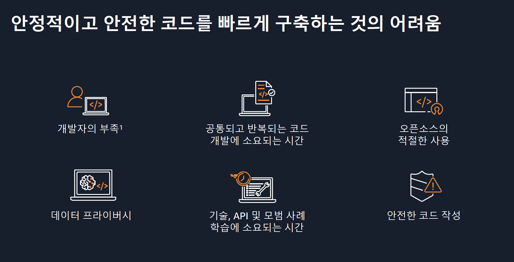
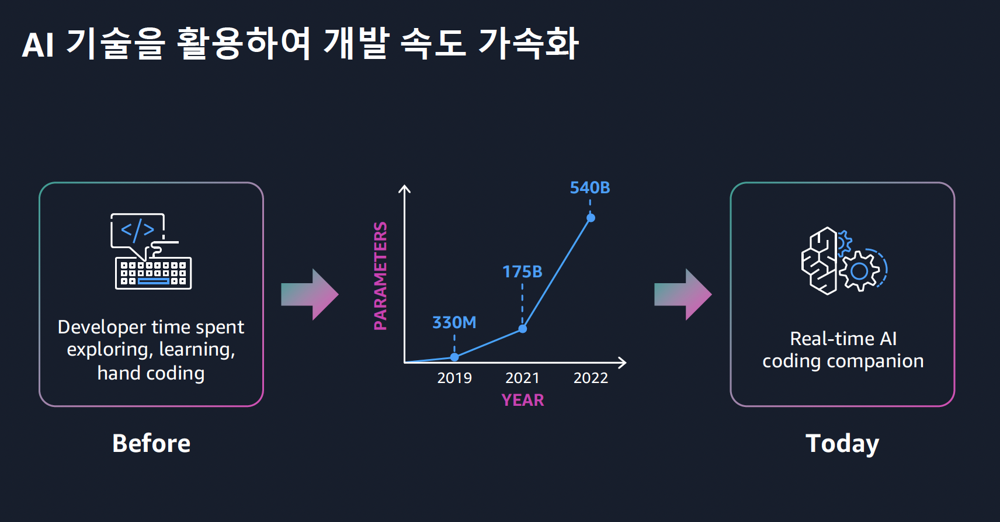
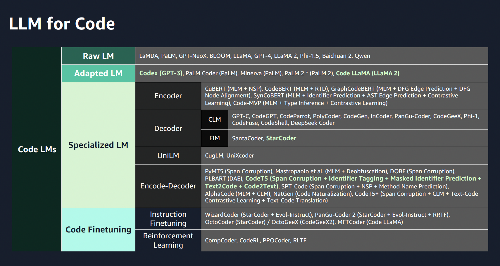
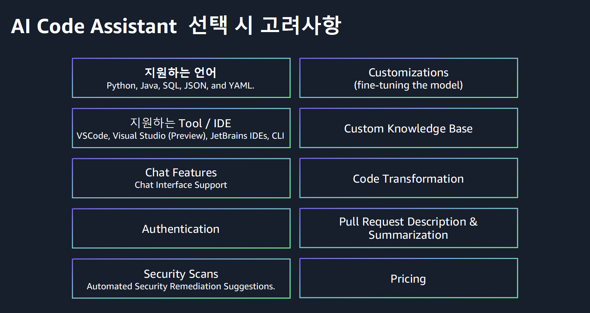
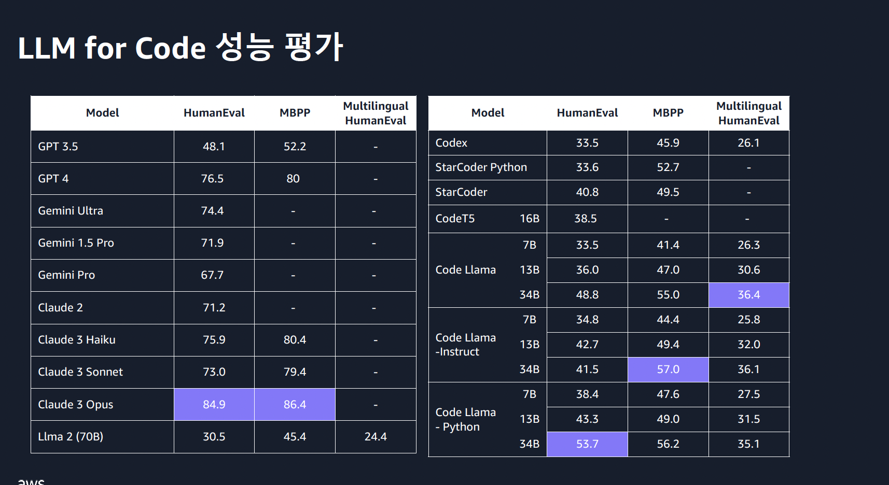
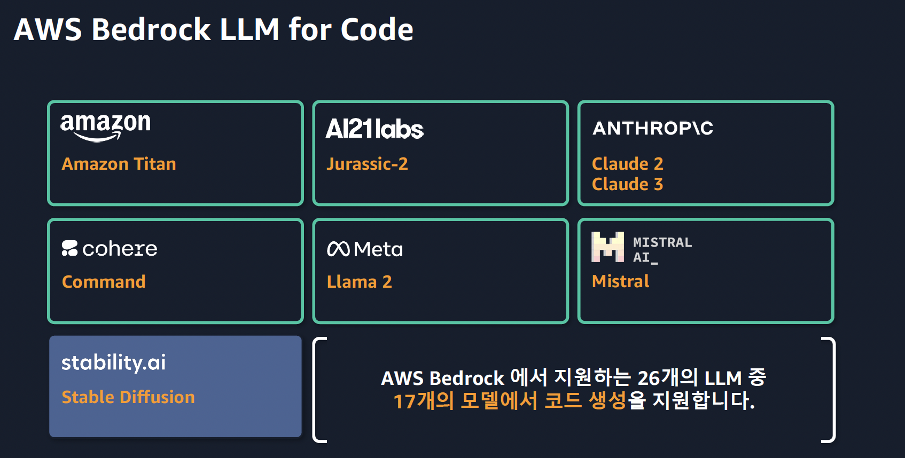

# Lab 4 - Code Generation(코드 생성)

Code Generation(코드 생성) Hands-on-Lab은 Amazon Bedrock 콘솔을 통해 어떤 프롬프트와 추론 파라미터, 그리고 모델을 사용할수 있는지를 먼저 배워보고,
어떤식으로 CodeLLM을 활용하여, 효율적으로 프로그래밍을 하는 것에 활용할 수 있는지 사용자 경험을 가져가시는 것을 목표로 하고 있습니다.
이 실습에서는 Amazon Bedrock에서 사용할 수 있는 Code LLM을 사용하여 코드를 생성, 이해, 디버깅 등 프로그래밍에 필요한 작업을 어떻게 효율화하는지를 살펴보겠습니다.

    
# 코드 생성 ( Code Generation )
## Overview

 

  

 
 

  

   

